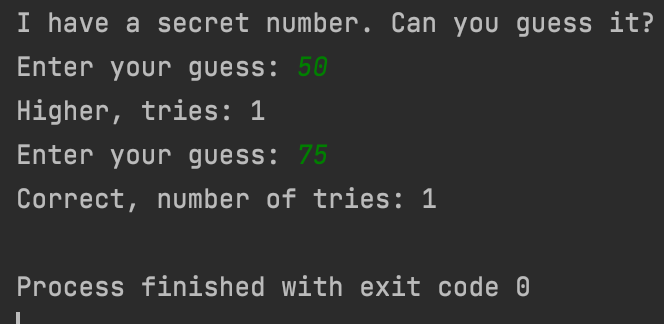

# Quiz 26

### Code

```.py
'''
This program is a game to guess a number from 1 to 100
'''
from random import randint

tries = 0
secret_number = randint(1, 100)
print("I have a secret number. Can you guess it?")
guess = int(input("Enter your guess: "))
while guess != secret_number:
    tries += 1
    if guess < secret_number:
        print(f"Higher, tries: {tries}")
    elif guess > secret_number:
        print(f"Lower, tries: {tries}")
    guess = int(input("Enter your guess: "))
print(f"Correct, number of tries: {tries}")
```

### Test


