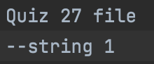

# Quiz 27

### Code

```.py
def generator(N:int, word:str):
    for i in range(1, N+1):
        file = open(f"{i}-{word}", 'w')
        file.write("Quiz 27 file \n--")
        file.write(f"{word} {i}")
        file.close()

generator(3, "string")
```

### Test


Creation of files


Text within files
