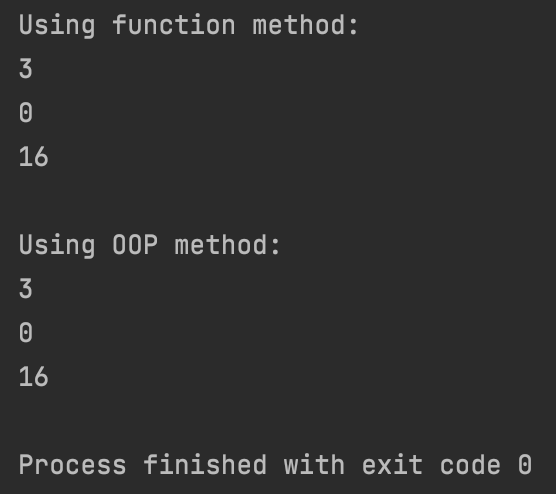

# Quiz 29

### Code

```.py
# function method
def find_two_divisors(number: int) -> int:
    '''
    The program finds the number of divisors of the input number that are divisible by 2
    '''
    divisors = 0
    for i in range(1, number+1):
        if number % i == 0 and i % 2 == 0: # first check if i is a divisor of the input, then checks if i is divisible by 2
            divisors += 1

    return divisors

print("Using function method:")
print(find_two_divisors(8))
print(find_two_divisors(9))
print(find_two_divisors(1092))
print(" ")

# OOP method
class Divisors:
    def __init__(self, number):
        self.number = number

    def get_twoDivisors(self):
        divisors = 0
        for i in range(1, self.number + 1):
            if self.number % i == 0 and i % 2 == 0:  # first check if i is a divisor of the input, then checks if i is divisible by 2
                divisors += 1

        return divisors

test_twoDivisors1 = Divisors(8)
test_twoDivisors2 = Divisors(9)
test_twoDivisors3 = Divisors(1092)
print("Using OOP method:")
print(test_twoDivisors1.get_twoDivisors())
print(test_twoDivisors2.get_twoDivisors())
print(test_twoDivisors3.get_twoDivisors())
```

### Test


