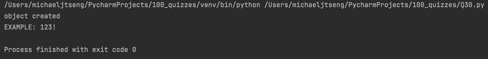

# Quiz 30

### Code

```.py
class broken_quiz:
    def __init__(self, code:str, seq:str):
        self.code = code
        self.seq = seq
        print("object created")

    def solve(self):
        n = len(self.code)
        if n!= len(self.seq):
            return -1

        indx = 0
        neg_indx = -1
        solution = ["" for _ in range(n)]
        for i in range(len(self.code)-1,-1,-1):
            curr_seq = self.seq[i]
            curr_cod = self.code[i]
            if 'S' in curr_seq:
                solution[indx] = curr_cod
                indx += 1
            else:
                solution[neg_indx] = curr_cod
                neg_indx -= 1
        return "".join(solution)

test_case = broken_quiz(code="231 :ELPMAXE!", seq="SESSSSSSSSSSE")
print(test_case.solve())
```

### Test


