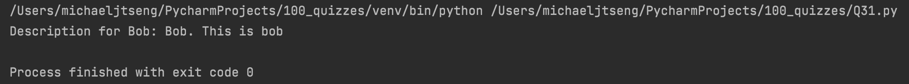

# Quiz 31

### Code

```.py
class User:
    '''
    This is the User class for quiz31
    '''

    # initializer
    def __init__(self, name:str, username:str, information:str, location:list = None): # self is simply a variable, can be named whatever
        self.name = name
        self.username = username
        self.information = information
        self.location = location

    # methods
    def get_location(self):
        return self.location # need to use self.location instead of location, since the variable location does not exist within the function

    def get_description(self):
        return self.username + '. ' + self.information # since self.username and self.information are strings, they can be concatenated


Bob = User(name='Bob', username='Bob', information='This is bob', location=['A22', 'ISAK'])
print(f'Description for Bob: {Bob.get_description()}')
```

### Test


