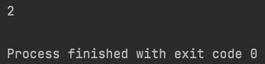

# Quiz 32

### Code

```.py
class Language:
    '''
    This program counts how many times a letter is present in a string
    '''
    def __init__(self, text:str, letter:str):
        self.text = text
        self.letter = letter

    def countLetter(self):
        count = self.text.count(self.letter)
        return count

class Writing(Language):
    '''
    This program is inherited from the class Language
    '''

words = Writing("The world is vast, vast", "a")
print(words.countLetter())
```

### Test


