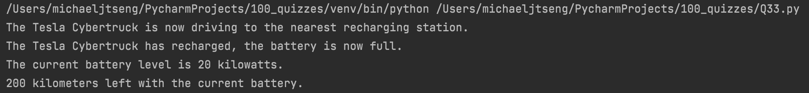

# Quiz 33

### Code

```.py
class Vehicle:
    def __init__(self, brand, model, type):
        self.brand = brand
        self.model = model
        self.type = type
        self.gas_tank_size = 14
        self.fuel_level = 0

    def fuel_up(self):
        self.fuel_level = self.gas_tank_size
        print('Gas tank is now full.')

    def drive(self):
        print(f"The {self.model} is now driving.")

class Electric_vehicle(Vehicle):
    def __init__(self, brand, model, type):
        super().__init__(brand, model, type)
        self.battery = Battery()  # Call a separate class as an attribute to use it in another class.
        self.battery_level = 0

    def recharge(self, new_value):
        self.battery.charge_battery(new_value)
        print(f"The {self.brand} {self.model} has recharged, the battery is now full.")

    def self_drive(self):
        print(f"The {self.brand} {self.model} is now driving to the nearest recharging station.")

class Battery:
    '''A class to represent the battery bank of an electric vehicle. The default size is 20 kilowatts.'''
    def __init__(self, size=20):
        self.size = size
        self.charge_level = 0

    def get_charge(self):
        '''This method returns the current charge level'''
        print(f"The current battery level is {self.charge_level} kilowatts.")

    def get_range(self):
        '''This method returns an estimate of the distance the car can drive with the current battery.'''
        print(f"{10*self.charge_level} kilometers left with the current battery.")

    def charge_battery(self, new_value):
        '''This method instantly recharges the battery level to a new input.'''
        if new_value <= self.size:
            self.charge_level = new_value
        elif new_value > self.size:
            self.charge_level = self.size

    def __repr__(self):
        return f"<Battery> size is {self.size} kilowatts, charge level is {self.charge_level} kilowatts."

electric_vehicle = Electric_vehicle("Tesla", "Cybertruck", "Car")
electric_vehicle.self_drive()
electric_vehicle.recharge(20)
electric_vehicle.battery.get_charge()
electric_vehicle.battery.get_range()
```

### Test


