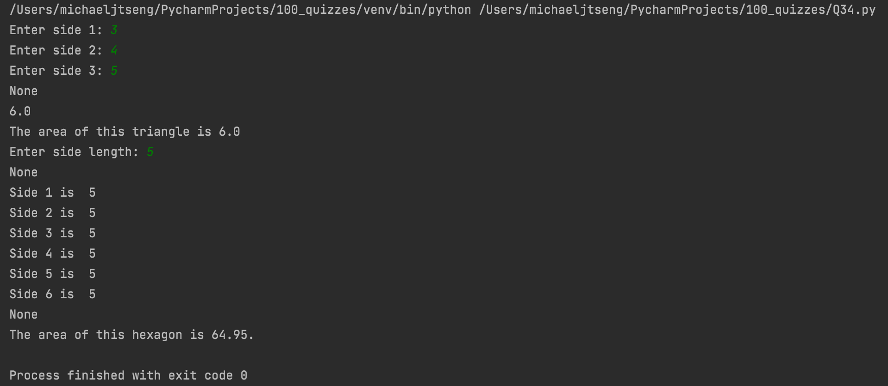

# Quiz 34

### Code

```.py
class Polygon:
    '''This class represents polygons'''
    def __init__(self, no_of_sides):
        self.no_of_sides = no_of_sides
        self.sides = []

    def inputSides(self):
        '''This method allows user to input side length(s)'''
        for i in range(self.no_of_sides):
            self.sides.append(int(input(f"Enter side {i+1}: ")))

    def showSides(self):
        for i in range(self.no_of_sides):
            print(f"Side {i+1} is  {self.sides[i]}")

class Triangle(Polygon):
    '''This class represents triangles'''
    def __init__(self, no_of_sides):
        super().__init__(no_of_sides)
        self.no_of_sides = 3

    def showArea(self):
        '''This method calculates the area of a triangle given 3 sides'''
        import math
        semi_p = (self.sides[0] + self.sides[1] + self.sides[2]) / 2
        print(semi_p)
        area = math.sqrt(semi_p * (semi_p - self.sides[0])*(semi_p - self.sides[1])*(semi_p - self.sides[2]))
        return f"The area of this triangle is {round(area,2)}"

class Hexagon(Polygon):
    '''This class represents hexagons'''
    def __init__(self, no_of_sides):
        super().__init__(no_of_sides)
        self.no_of_sides = 6

    def inputSides(self):
        '''Override the Polygon inputSides function to use only 1 input and apply it to all sides'''
        side = int(input(f"Enter side length: "))
        for i in range(self.no_of_sides):
            self.sides.append(side)

    def showArea(self):
        '''This method calculates the area of a hexagon'''
        import math
        area = (3 * math.sqrt(3) * (self.sides[0] ** 2)) / 2
        return f"The area of this hexagon is {round(area, 2)}."

# test for triangle area calculation
triangle_1 = Triangle(3)
print(triangle_1.inputSides())
print(triangle_1.showArea())

# test for hexagon area calculation
hexagon1 = Hexagon(6)
print(hexagon1.inputSides())
print(hexagon1.showSides())
print(hexagon1.showArea())
```

### Test


