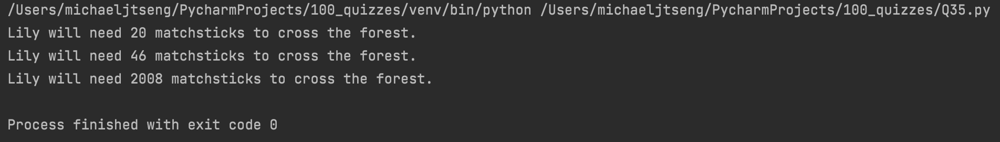

# Quiz 35

### Code

```.py
import math
class Lily:
    def __init__(self, l:int, s:int):
        self.l = l
        self.s = s
        self.matchstick_dur = 5

    def get_matchsticks(self):
        no_matchsticks = ((self.l.__mul__(100)) / (self.s)) / self.matchstick_dur
        return f"Lily will need {math.ceil(no_matchsticks)} matchsticks to cross the forest."

    def __mul__(self, other):
        return self * other

test1 = Lily(100, 100)
test2 = Lily(250, 110)
test3 = Lily(12345, 123)
print(test1.get_matchsticks())
print(test2.get_matchsticks())
print(test3.get_matchsticks())
```

### Test


