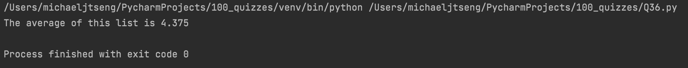

# Quiz 36

### Code

```.py
'''
~The four properties of the OOP programming paradigm~
- Encapsulation
- Abstraction
- Polymorphism
- Inheritance 

~Identify the components of a UML diagram for Classes~
A UML diagram is represented in a rectangle with partitions between each part of a class.
At the top is the class name, under that are all the attributes of the class, and finally the methods are under those.

~A UML diagram is shown below for a score calculation. Create an object and obtain the average~
'''
class Scores:
    def __init__(self, results:list[int]):
        self.results = results
        self.average = 0

    def getAverage(self):
        for number in self.results:
            self.average += number
        return f"The average of this list is {self.average / len(self.results)}"

test = Scores([2, 4, 6, 3, 4, 6, 2, 8])
print(test.getAverage())
```

### Test


