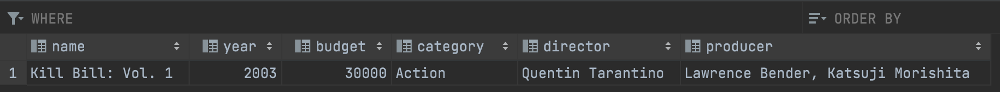

# Quiz 38

### SQL Code
```.sql
DROP TABLE Movies
CREATE TABLE Movies (
    name VARCHAR(100),
    year INTEGER,
    budget INTEGER,
    category VARCHAR(255),
    director VARCHAR(255),
    producer VARCHAR(255)
);
INSERT INTO Movies (name, year, budget, category, director, producer) values ('Kill Bill: Vol. 1', 2003, 30000, 'Action', 'Quentin Tarantino', 'Lawrence Bender, Katsuji Morishita');
SELECT * from Movies
```

### Test


