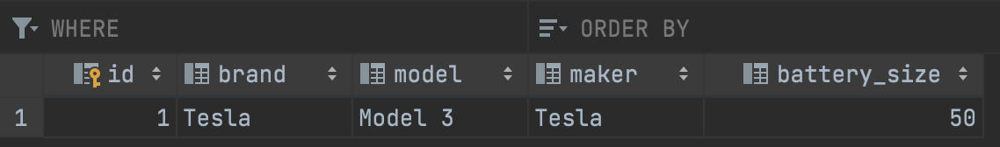

# Quiz 39

### Code
```.py
import sqlite3

class database_handler():
    def __init__(self, db_name):
        self.name = db_name
        self.connection = sqlite3.connect(self.name)
        self.cursor = self.connection.cursor()

    def create(self):
        self.cursor.execute("""
        CREATE TABLE if not exists Electric_cars(
        id INTEGER primary key,
        brand varchar(255),
        model varchar(255),
        maker varchar(255),
        battery_size INTEGER);
        """)
        self.connection.commit()

    def add_test_car(self):
        self.cursor.execute("""
        INSERT INTO Electric_cars (id, brand, model, maker, battery_size) values (1, "Tesla", "Model 3", "Tesla", 50);
        """)
        self.connection.commit()

    def clear(self):
        self.cursor.execute("""
        DROP TABLE Electric_cars;
        """)
        self.connection.commit()

test = database_handler("Q39.db")
test.create()
test.add_test_car()
```

### Test


