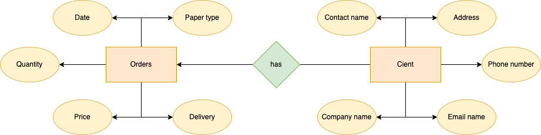

# Quiz 41

### ER Diagram



### Python code

```.py
from sqlalchemy import Column, Integer, String, Date, Float, ForeignKey, create_engine
from sqlalchemy.orm import declarative_base

Base = declarative_base()


class Clients(Base):
    """ This class creates the Clients table"""
    __tablename__ = "Clients"
    id = Column(Integer, primary_key=True)
    name = Column(String(255))
    email = Column(String(255))
    address = Column(String(255))
    phone_number = Column(Integer)
    company_name = Column(String(255))


class Orders(Base):
    """ This class creates Orders table"""
    __tablename__ = "Orders"
    id = Column(Integer, primary_key=True)
    date = Column(Date)
    price = Column(Float)
    quantity = Column(Integer)
    type = Column(String(255))
    delivery_date = Column(Date)
    # Foreign key allows the table to access data from the Clients table
    user_id = Column(Integer, ForeignKey("Clients.id"))

# execute the command to create the tables
db_engine = create_engine("sqlite:///Q41.db")
Base.metadata.create_all(db_engine)
```

### Test

#### Client table


#### Orders table


