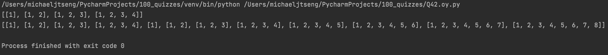

# Quiz 42

### Code

```.py
class Shell():
    def __init__(self, n:int, array=[]):
        self.n = n
        self.array = array

    def mapper(self):
        for i in range(1, self.n+1):
            inside = []
            for o in range(1, i+1):
                inside.append(o)
            self.array.append(inside)
        return self.array

test1 = Shell(4)
test2 = Shell(8)
print(test1.mapper())
print(test2.mapper())
```

### Test


