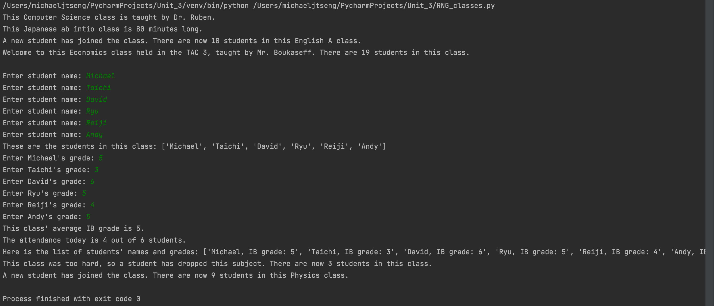

# 3 Classes

### Code

```.py
class Classes:
    def __init__(self,name:str, classroom:str, teacher:str, class_size:int):
        self.name = name
        self.length = 80
        self.classroom = classroom
        self.teacher = teacher
        self.class_size = class_size

    def getTeacher(self):
        ''' This method returns the name of the teacher of the class '''
        return f"This {self.name} class is taught by {self.teacher}."

    def getLength(self):
        ''' This method returns the time length of the class '''
        return f"This {self.name} class is {self.length} minutes long."

    def addStudent(self):
        ''' This method adds a new student to the class '''
        self.class_size += 1
        return f"A new student has joined the class. There are now {self.class_size} students in this {self.name} class."

    def dropStudent(self):
        ''' This method removes a student from the class '''
        self.class_size -= 1
        return f"A student has left the class. There are now {self.class_size} students in this {self.name} class."

    def getClassSize(self):
        return self.class_size

    def __repr__(self):
        return f"Welcome to this {self.name} class held in the {self.classroom}, taught by {self.teacher}. There are {self.class_size} students in this class."

class Physics(Classes):
    def __init__(self, class_size: int, name="Physics", classroom="Physics lab", teacher="Ms. Ng"):
        super().__init__(name, classroom, teacher, class_size)
        self.name = name
        self.teacher = teacher
        self.classroom = classroom
        self.avg_grade = 0
        self.students = Students(self.class_size)

    def dropStudent(self):
        ''' Override the dropStudent method in class Classes to return a new message '''
        self.class_size -= 1
        return f"This class was too hard, so a student has dropped this subject. There are now {self.class_size} students in this class."

    def getAvgGrade(self):
        ''' This method returns the average grade of the class' students'''
        for i in self.students.setGrade():
            self.avg_grade += int(i)
        self.avg_grade /= self.class_size
        return f"This class' average IB grade is {round(self.avg_grade)}."

    def getNames(self):
        ''' This method calls the getNames method from class Students '''
        return self.students.getNames()

    def getAttendance(self):
        ''' This method calls the getAttendance method from class Students '''
        total_attendance = 0
        for rate in self.students.getAttendance():
            if rate == 1:
                total_attendance += 1
        return f"The attendance today is {total_attendance} out of {self.class_size} students."

    def __repr__(self):
        ''' This method calls the __repr__ method from class Students'''
        return self.students.__repr__()

class Students:
    def __init__(self, class_size, names=[], attendance=[], grades=[], description=[]):
        self.names = names
        self.attendance = attendance
        self.grades = grades
        self.class_size = class_size
        self.description = description

    def getNames(self):
        ''' This method adds the names of the students in the class'''
        for i in range(self.class_size):
            self.names.append(input("Enter student name: "))
        return f"These are the students in this class: {self.names}"

    def getAttendance(self):
        ''' This method applies an attendance rate for each student '''
        import random
        for i in range(self.class_size):
            self.attendance.append(random.randint(0, 1))
        return self.attendance

    def setGrade(self):
        ''' This method sets a grade for each student in the class '''
        for i in range(self.class_size):
            self.grades.append(int(input(f"Enter {self.names[i]}'s grade: ")))
        return self.grades

    def __repr__(self):
        ''' This method returns the full list of each student (name, grade)'''
        for i in range(self.class_size):
            self.description.append(f"{self.names[i]}, IB grade: {self.grades[i]}")
        return f"Here is the list of students' names and grades: {self.description}"

# Objects for first class
class1 = Classes("Computer Science", "Physics lab", "Dr. Ruben", 10)
class2 = Classes("Japanese ab intio", "KAC 1", "Arico sensei", 8)
class3 = Classes("English A", "KAC 5", "Mr. Underwood", 9)
class4 = Classes("Economics", "TAC 3", "Mr. Boukaseff", 19)
print(class1.getTeacher())
print(class2.getLength())
print(class3.addStudent())
print(class4)
print('')

# Objects for second class
physics1 = Physics(6)
physics2 = Physics(4)
physics3 = Physics(8)
physics4 = Physics(5)
print(physics1.getNames())
print(physics1.getAvgGrade())
print(physics1.getAttendance())
print(physics1)
print(physics2.dropStudent())
print(physics3.addStudent())
```

### Test


