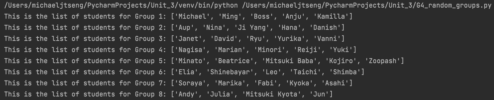

# G4 Random Group Maker

### Code

```.py
import random

# set the seed for the randomizer so the program is reproducible
random.seed(2022)

# create class to append names to groups
class Groups:

    # initializer to define variables
    def __init__(self, names:list, size:int):
        # empty list of new group
        self.names = names
        # list of all student names in the grade
        self.all_names = ["Danish", "Marika", "Minato", "Aup", "Mitsuki Baba", "Shinebayar", "Fabi", "Soraya", "Zoopash", "Julia", "Taichi", "Yurika", "Beatrice", "Elia", "Kyoka", "Ryu", "Leo", "Mitsuki Kyota", "Ming", "Marian", "Kamilla", "Kojiro", "Jun", "Ji Yang", "Reiji", "Minori", "Shimba", "Vanni", "Nagisa", "Boss", "Nina", "Hana", "David", "Asahi", "Michael", "Yuki", "Janet", "Anju", "Andy"]
        # size of new group
        self.size = size

    # method to add students to groups
    def addStudent(self):
        for i in range(self.size):
            # pick a random name from the full list of students
            one_name = self.all_names[random.randint(0, len(self.all_names)-1)]
            # append that name to new group
            self.names.append(one_name)
            # remove that name from full list so there are no repeats
            self.all_names.remove(one_name)
        # return the list of names in the new group
        return self.names

# create objects for class Groups
group1 = Groups([], 5)
group2 = Groups([], 5)
group3 = Groups([], 5)
group4 = Groups([], 5)
group5 = Groups([], 5)
group6 = Groups([], 5)
group7 = Groups([], 5)
group8 = Groups([], 4)

# append names to each group and print list
print("This is the list of students for Group 1:", group1.addStudent())
print("This is the list of students for Group 2:", group2.addStudent())
print("This is the list of students for Group 3:", group3.addStudent())
print("This is the list of students for Group 4:", group4.addStudent())
print("This is the list of students for Group 5:", group5.addStudent())
print("This is the list of students for Group 6:", group6.addStudent())
print("This is the list of students for Group 7:", group7.addStudent())
print("This is the list of students for Group 8:", group8.addStudent())
```

### Test


