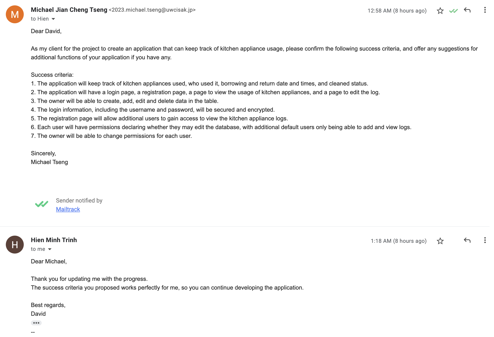

# Table of contents

1. [Criterion A: Planning](https://github.com/MichaelT2828/Unit_3/blob/main/Project_3/Documentation.md#criterion-a-planning)

# Criterion A: Planning

## Problem Definition

My client, Hien Minh Trinh (David) regularly uses the kitchen, and often finds there are an excess amount of dishes and kitchen equipment that are unwashed, or in need of maintenence.
As such, he requires an application to manage the usage of kitchen appliances in his house, so he is able to keep his housemates accountable for the kitchen appliances they use. 
The application must be able to log when someone borrows a certain kitchen appliance, who borrowed it, when it was returned, and whether it was cleaned or not. 

## Proposed Solution

### Design Statement

To solve David's problem, I will create an application to manage the usage of kitchen appliances in his house. I will be be using Python as the primary programming language for the application, KivyMD for the graphical user interface (GUI), and SQLAlchemy to manipulate the database in which the kitchen appliance logs will be stored.
The application will consist of a login page, a registration page, a page to view the usage of kitchen appliances, and a page to edit the log. 

### System

The application to manage kitchen appliance usage will be developed on the programming editor PyCharm version 2021.2.2, run on a 2019 MacBook Pro using the os macOS Big Sur version 11.5.2.
Through PyCharm, the application will be coded using Python, KivyMD for the GUI, and SQLAlchemy to manipulate the database.

### Software Justification

***Python***

I will be using Python as the primary programming language for the following reasons. Firstly, Python is high-level, interpreted, simple syntax language, making it accessible to beginner programmers while still maintaining a high degree of
flexibility and practicality for a variety of projects. Additionally, Python is regarded as one of the fastest growing programming languages[[1]](https://www.bairesdev.com/technologies/why-is-python-top-language/), which means the resources online
that may aid in the developement of this project will be abundant. Secondly, ranked above C, I am most familiar coding in Python, which will make the project run much faster than if I would need to learn a new programming language. Lastly, Python is 
an object-oriented programming language, which will be useful for this project since OOP frameworks are modular, making it easy to identify problems in the code, the code can be reusable through inheritance, and functions can be flexible and usable across multiple classes due to polymorphism[[2]](https://www.roberthalf.com/blog/salaries-and-skills/4-advantages-of-object-oriented-programming).

***KivyMD***

I will be using KivyMD to create the graphical user interface, which is an open source library capable of creating graphical user interfaces (GUI) for applications[[3]](https://kivymd.readthedocs.io/en/latest/). In this project, the GUI will act as the communication between the user, who will input commands and view information through their keyboard and computer screen,
and the program, which will manipulate the database to create, add, edit and delete data. The GUI is a crucial component of this application, as it will allow the client, or anyone including those without experience in programming, to easily access the kitchen appliance logs. 

***SQLAlchemy***

I will be using SQLAlchemy to manipulate the database for the following reasons. Firstly, "SQLAlchemy is the Python SQL toolkit and Object Relational Mapper that gives application developers the full power and flexibility of SQL."[[4]](https://www.sqlalchemy.org/). Since I will be using Python, SQLAlchemy will allow me to take advantage of the SQL programming language, which is used for operating databases[[5]](https://www.w3schools.com/sql/sql_intro.asp).
Additionally, since it is an Object Relational Mapper (ORM), I will be able to query and manipulate data from a database without having to learn SQL[[6]](https://talentopia.global/back-end/orm-vs-plain-sql-which-should-you-choose-and-when), and instead use the native programming language I am familiar with, Python.  

### Success Criteria

1. The application will keep track of kitchen appliances used, who used it, borrowing and return date and times, and cleaned status.
2. The application will have a login page, a registration page, a page to view the usage of kitchen appliances, and a page to edit the log.
3. The owner will be able to create, add, edit and delete data in the table.
4. The login information, including the username and password, will be secured and encrypted.
5. The registration page will allow additional users to gain access to view the kitchen appliance logs.
6. Each user will have permissions declaring whether they may edit the database, with additional default users only being able to add and view logs.
7. The owner will be able to change permissions for each user.

### Client Confirmation

### Citations

1. “Why Is Python Considered the Top Programming Language?” BairesDev, 5 July 2021, https://www.bairesdev.com/technologies/why-is-python-top-language/. 
2. Robert Half. “4 Advantages of Object-Oriented Programming.” 4 Advantages of OOP | Robert Half, Robert Half, 4 Dec. 2021, https://www.roberthalf.com/blog/salaries-and-skills/4-advantages-of-object-oriented-programming. 
3. Rodríguez, A. (2021). Welcome to KIVYMD's documentation!. Welcome to KivyMD's documentation! - KivyMD 1.0.0.dev0 documentation. Retrieved March 26, 2022, from https://kivymd.readthedocs.io/en/latest/ 
4. “The Python SQL Toolkit and Object Relational Mapper.” SQLAlchemy, https://www.sqlalchemy.org/. 
5. “Introduction to SQL.” SQL Introduction, https://www.w3schools.com/sql/sql_intro.asp. 
6. “Orm Vs Plain SQL: Which Should You Choose and When.” Talentopia, https://talentopia.global/back-end/orm-vs-plain-sql-which-should-you-choose-and-when. 
