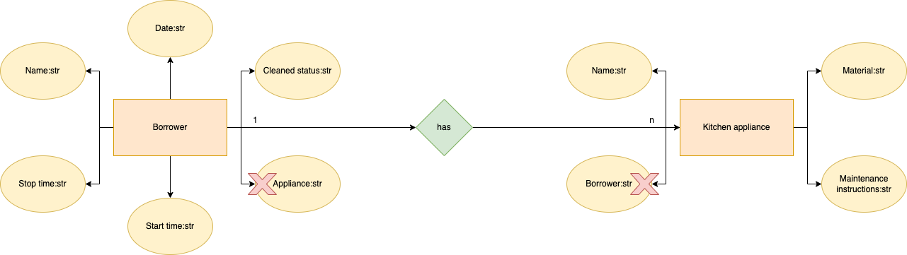
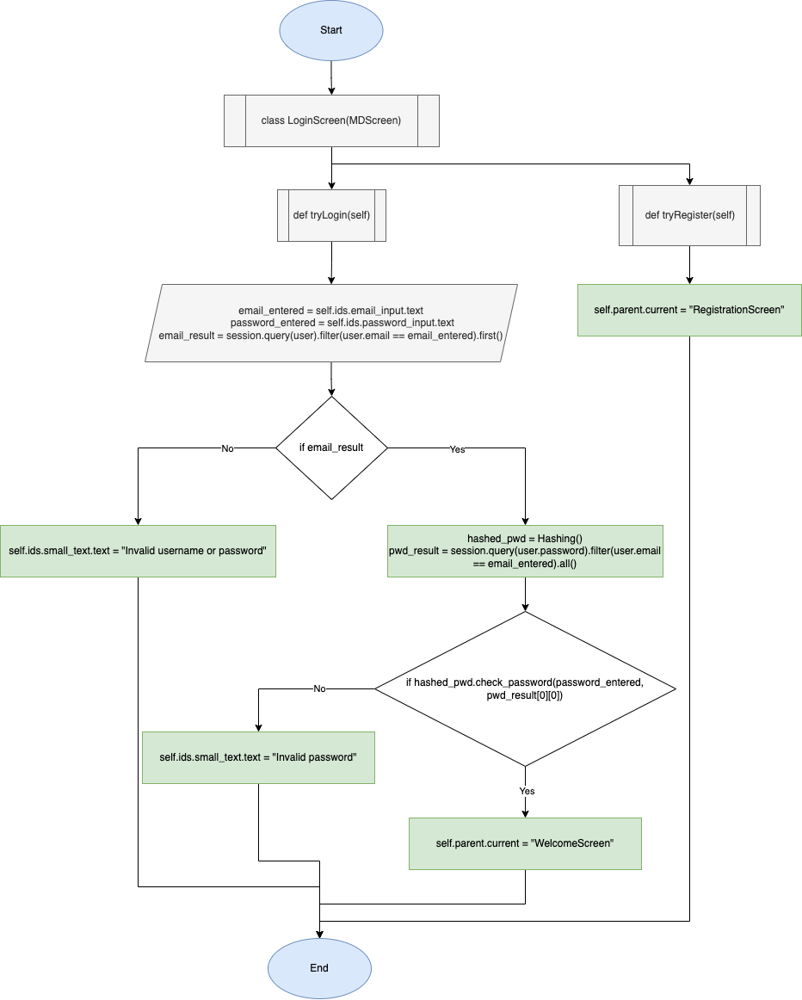
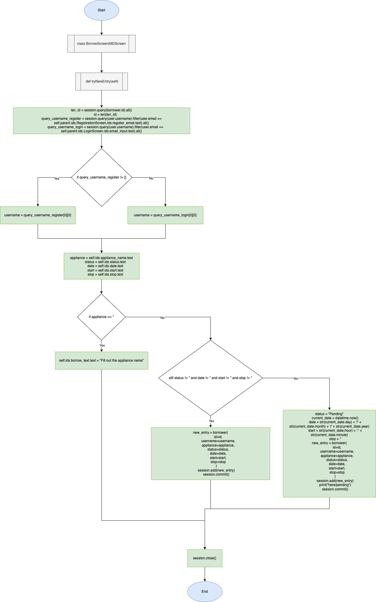

# Table of contents

1. [Criterion A: Planning](https://github.com/MichaelT2828/Unit_3/blob/main/Project_3/Documentation.md#criterion-a-planning)
2. [Criterion B: Solution Overview](https://github.com/MichaelT2828/Unit_3/edit/main/Project_3/Documentation.md#criterion-b-solution-overview)
3. [Criterion C: Development](https://github.com/MichaelT2828/Unit_3/edit/main/Project_3/Documentation.md#criterion-c-development)
4. [Criterion D: Functionality](https://github.com/MichaelT2828/Unit_3/edit/main/Project_3/Documentation.md#criterion-d-functionality)
5. [Citations](https://github.com/MichaelT2828/Unit_3/edit/main/Project_3/Documentation.md#citations)

# Criterion A: Planning

## Problem Definition

My client regularly uses the kitchen, and often finds there are an excess amount of dishes and kitchen equipment that are unwashed, or in need of maintenence. 
As such, he requires an application to manage the usage of kitchen appliances in his house, so he is able to keep his housemates accountable for the kitchen appliances they use. Compared to analog recording, the information the client needs is stored digitally, which is more secure since it won't get lost like a piece of paper might. Additionally, an application will be much more versatile, for example being able to easily add, delete and edit data on a table, whereas on an analog table the client would have to manually erase and write in new data.
The application must be able to log when someone borrows a certain kitchen appliance, who borrowed it, when it was returned, and whether it was cleaned or not. 

## Proposed Solution

### Design Statement

To solve my client's problem, I will create an application to manage the usage of kitchen appliances in his house. I will be be using Python as the primary programming language for the application, KivyMD for the graphical user interface (GUI), and SQLAlchemy to manipulate the database in which the kitchen appliance logs will be stored.
The application will consist of a login page, a registration page, a page to view the usage of kitchen appliances, and a page to edit the log. 

### System

The application to manage kitchen appliance usage will be developed on the programming editor PyCharm version 2021.2.2, run on a 2019 MacBook Pro using the os macOS Big Sur version 11.5.2.
Through PyCharm, the application will be coded using Python, KivyMD for the GUI, and SQLAlchemy to manipulate the database.

### Software Justification

***Python***

I will be using Python as the primary programming language for the following reasons. Firstly, Python is high-level, interpreted, simple syntax language, making it accessible to beginner programmers while still maintaining a high degree of
flexibility and practicality for a variety of projects. Additionally, Python is regarded as one of the fastest growing programming languages<sup>[[1]](https://www.bairesdev.com/technologies/why-is-python-top-language/)</sup>, which means the resources online
that may aid in the developement of this project will be abundant. Secondly, ranked above C, I am most familiar coding in Python, which will make the project run much faster than if I would need to learn a new programming language. Lastly, Python is 
an object-oriented programming language, which will be useful for this project since OOP frameworks are modular, making it easy to identify problems in the code, the code can be reusable through inheritance, and functions can be flexible and usable across multiple classes due to polymorphism<sup>[[2]](https://www.roberthalf.com/blog/salaries-and-skills/4-advantages-of-object-oriented-programming)</sup>.

***KivyMD***

I will be using KivyMD to create the graphical user interface, which is an open source library capable of creating graphical user interfaces (GUI) for applications<sup>[[3]](https://kivymd.readthedocs.io/en/latest/)</sup>. In this project, the GUI will act as the communication between the user, who will input commands and view information through their keyboard and computer screen, and the program, which will manipulate the database to create, add, edit and delete data. The GUI is a crucial component of this application, as it will allow the client, or anyone including those without experience in programming, to easily access the kitchen appliance logs. 

***SQLAlchemy***

I will be using SQLAlchemy to manipulate the database for the following reasons. Firstly, "SQLAlchemy is the Python SQL toolkit and Object Relational Mapper that gives application developers the full power and flexibility of SQL."<sup>[[4]](https://www.sqlalchemy.org/)</sup>. Since I will be using Python, SQLAlchemy will allow me to take advantage of the SQL programming language, which is used for operating databases<sup>[[5]](https://www.w3schools.com/sql/sql_intro.asp)</sup>.
Additionally, since it is an Object Relational Mapper (ORM), I will be able to query and manipulate data from a database without having to learn SQL<sup>[[6]](https://talentopia.global/back-end/orm-vs-plain-sql-which-should-you-choose-and-when)</sup>, and instead use the native programming language I am familiar with, Python.  

### Success Criteria

1. The application will keep track of kitchen appliances used, who used it, borrowing and return date and times, and cleaned status.
2. The application will use a GUI to show a login page, a registration page, a menu page, a page to view the usage information of kitchen appliances, and a page to edit the log.
3. The users will be able to create, add, edit and delete data in the table.
4. The login information, such as the username, email and password, will be secured and the password will be encrypted through a hash.
5. The registration page will allow additional users to gain access to use the application.
6. The users will be able to log out of the application.

### Client Confirmation


# Criterion B: Solution Overview

## Wireframe diagram of solution


***Figure 1:*** . Wireframe diagram or sketch of proposed GUI. Shows a total of 7 screens, login and register screens, main menu, 2 table screens and 2 input screens.

## System diagram


***Figure 2:*** . System diagram of the application

## UML diagram


***Figure 3:*** . UML diagram of the application, showing the attributes of each database and their relationships with each other.

## ER diagram



***Figure 4:*** . ER diagram showing the relationship between Borrowers and Kitchen Appliances. Visualized version of the database.

## ER table (example)

| ID    | Username | Email                           | Password    |
|-------|----------|---------------------------------|-------------|
| 47654 | David    | 2023.hien.minh.trinh@uwcisak.jp | david032    |
| 3548  | Michael  | 2023.michael.tseng@uwcisak.jp   | castironpan |

***Figure 5:*** . An example of the table for the registered user list.

| ID | Username | Appliance | Status  | Date      | Start | Stop  |
|----|----------|-----------|---------|-----------|-------|-------|
| 0  | David    | Wok       | Cleaned | 27/3/2022 | 17:00 | 19:00 |
| 1  | Michael  | Cast iron | Pending | 27/3/2022 | 18:00 |       |

***Figure 6:*** . An example of the table for the borrow logs.

| ID | Name      | Maintenance instruction                                                                                                                                                                | Material                      |
|----|-----------|----------------------------------------------------------------------------------------------------------------------------------------------------------------------------------------|-------------------------------|
| 0  | Wok       | Cooking: Refrain from scratching with metal utensils. Washing: Refrain from scrubbing with metal abrasives.                                                                            | Teflon coated stainless steel |
| 1  | Cast iron | Seasoning: Coat pan in oil and dry with paper towel. Bake in over at max temp for 1 hour. Washing: Refrain from scrubbing with soap or metal abrasives, dry immediately after rinsing. | Cast iron                     |

***Figure 7:*** . An example of the table for the kitchen appliance list.

## Flow diagrams



***Figure 8:*** . Shows the OOP class for the login page, used to allow the user access to the rest of the application.



***Figure 9:*** . Shows the OOP class for the borrow input page, used to input data into a table. 


***Figure 10:*** . Shows the OOP class for the hashing function used to encrypt and check passwords.

## Record of tasks

| No. | Task                                          | Planned Outcome                                                                                                                                | Time Estimate | Target Completion date | Criterion |
|-----|-----------------------------------------------|------------------------------------------------------------------------------------------------------------------------------------------------|---------------|------------------------|-----------|
| 1   | First meeting with client                     | Identify problem, set up future meeting(s)                                                                                                     | 10 min        | March 2                | A         |
| 2   | Create proposed solution and success criteria | Create a detailed proposed solution and success criteria to client's problem, send to client for confirmation                                  | 20 min        | March 2                | A         |
| 3   | Research rationale                            | Research and create a logical rationale behind the tools used for the proposed solution                                                        | 40 min        | March 7                | A         |
| 4   | Create login page                             | Program the kivymd and python files for the GUI and functionality of the login page                                                            | 3 hr          | March 25               | C         |
| 5   | Create registration page                      | Program the kivymd and python files for the GUI and functionality of the registration page                                                     | 2 hr          | March 27               | C         |
| 6   | Create wireframe diagram                      | Design the wireframe diagram of the application                                                                                                | 30 min        | March 27               | B         |
| 7   | Create system diagram                         | Design the system diagram of the application                                                                                                   | 30 min        | March 27               | B         |
| 8   | Create ER table and diagram                   | Design the ER table and diagram for the application                                                                                            | 30 min        | March 27               | B         |
| 9   | Create welcome page                           | Program the kivymd and python files for the GUI and functionality of the main menu                                                             | 3 hr          | April 3                | C         |
| 10  | Create database                               | Create 3 database tables (users, borrowers, appliances) using SQLAlchemy ORM                                                                   | 2 hr          | April 3                | C         |
| 11  | Create password hashing function              | Create a function to encrypt user passwords for security                                                                                       | 30 min        | April 3                | C         |
| 12  | Create first table screen                     | Program the kivymd and python files for the GUI and functionality of the first table screen, which displays the log of borrowers               | 3 hr          | April 10               | C         |
| 13  | Create first table screen input               | Program the kivymd and python files for the GUI and functionality to input data into the first table                                           | 3 hr          | April 10               | C         |
| 14  | Create second table screen                    | Program the kivymd and python files for the GUI and functionality of the second table screen, which displays the kitchen appliance information | 2 hr          | April 17               | C         |
| 15  | Create second table screen input              | Program the kivymd and python files for the GUI and functionality to input data into the second table                                          | 2 hr          | April 17               | C         |
| 16  | Create flow diagrams                          | Design 3 flow diagrams to showcase modules of functionality from the python file                                                               | 30 min        | April 20               | B         |
| 17  | Clean up code                                 | Final bug fixes and commenting, good coding practices                                                                                          | 1 hr          | April 20               | C         |
| 18  | Final testing                                 | Final functionality testing by following the test plan                                                                                         | 30 min        | April 21               | D         |
| 19  | Create demonstration video                    | Create video showcasing complete functionality of the application                                                                              | 1 hr          | April 21               | D         |

## Test plan

| Instruction                        | Category     | Input example / code                               | Description                                                                                                        | Expected output                                                         | Success criteria |
|------------------------------------|--------------|----------------------------------------------------|--------------------------------------------------------------------------------------------------------------------|-------------------------------------------------------------------------|------------------|
| Test registration system           | Unit testing | username, email, password, confirm password        | Save a new user to the database                                                                                    | Input is added to database "users", window is switched to main menu     | 2, 4, 5          |
| Test login system                  | Unit testing | email, password                                    | Log in with an existing user                                                                                       | Input is checked with database "users", window is switched to main menu | 2, 4             |
| Test logout system                 | Unit testing | Click button "Logout"                              | Log out of the application, returning to the login page                                                            | Window is switched to login page, user must log back in to re-access    | 6                |
| Test new borrow                    | Unit testing | Click button "New Borrow"                          | Access a page to input data into borrow logs                                                                       | Window is switched to new borrow page                                   | 1, 2, 3          |
| Test new borrow input              | Unit testing | appliance name, cleaned status, date, start, stop  | Input data into borrow logs                                                                                        | Input is saved to database "borrow"                                     | 1, 2, 3          |
| Test go back button                | Unit testing | Click icon button                                  | Return to main menu page                                                                                           | Window is switched to main menu                                         | 2                |
| Test view borrow logs              | Unit testing | Click button "Borrow Logs"                         | Show the table of borrow logs                                                                                      | Window is switched to borrow logs page                                  | 1, 2             |
| Test delete from borrow logs       | Unit testing | Select row from table and click button "Delete"    | Delete rows of data from the borrow logs                                                                           | Data is deleted from database "borrow"                                  | 3                |
| Test complete borrow               | Unit testing | Select row from table and click button "Complete"  | Add additional data into a row in the borrow logs                                                                  | Data is appended to a row in database "borrow"                          | 3                |
| Test new appliance                 | Unit testing | Click button "New Appliance"                       | Access a page to input data into appliance list                                                                    | Window is switched to new appliance page                                | 1, 2, 3          |
| Test new appliance input           | Unit testing | appliance name, maintenance instructions, material | Input data into appliance list                                                                                     | Input is saved to database "appliance"                                  | 1, 2, 3          |
| Test view appliance list           | Unit testing | Click button "Kitchen Appliances"                  | Show the table of kitchen appliances                                                                               | Window is switched to kitchen appliances page                           | 1, 2             |
| Test delete from appliance list    | Unit testing | Select row from table and click button "Delete"    | Delete rows of data from the borrow logs                                                                           | Data is deleted from database "appliance"                               | 3                |
| Test for bugs                      | Code review  | -                                                  | Test different input types for all inputs in the application                                                       | -                                                                       |                  |
| Documentation and in-code comments | Code review  | -                                                  | Make sure documentation and comments clearly explain the purpose of each class, method and function in the program | -                                                                       |                  |

# Criterion C: Development

## Programming Techniques Used:

1. Object Oriented Programming (OOP)
2. Python 3.9
3. KivyMD Library
4. SQLAlchemy Object Relational Mapping (ORM) Library
5. pbkd2f Hashing

## Database configuration

This application is centered around the usage of relational databases. There are three database tables in this application, performing two primary tasks. Firstly, the "user" database is used to control the login and registration system, Secondly, the "borrower" and "appliance" database is used to display information to the user. The initial creation of each database was executed through a separate file named "database_models.py". Here are the steps to create the necessary databases:

Firstly import all the necessary functions to create and manage a database, and declare a Base.
```.py
from sqlalchemy import Column, Integer, String, create_engine, ForeignKey
from sqlalchemy.orm import declarative_base

Base = declarative_base()
```

Then create classes for each database table.
```.py
class user(Base):
    '''This class represents each user's information'''
    # name of the table
    __tablename__ = "Users"
    # each "attribute" is a field in the table
    id = Column(Integer, primary_key=True)
    username = Column(String(250))
    email = Column(String(250), nullable=False)
    password = Column(String(256), nullable=False)

    def __init__(self, id, username, email, password):
        # create an initializer to allow input into the table
        self.id = id
        self.username = username
        self.email = email
        self.password = password


class appliance(Base):
    '''This class represents the information about each kitchen appliance'''
    __tablename__ = "Appliances"
    # each "attribute" is a field in the table
    id = Column(Integer, primary_key=True)
    name = Column(String(250))
    maintenance_instruction = Column(String(256))
    material = Column(String(250))

    def __init__(self, id, name, maintenance_instruction, material):
        self.id = id
        self.name = name
        self.maintenance_instruction = maintenance_instruction
        self.material = material


class borrower(Base):
    '''This class represents the entries for borrowing kitchen appliances'''
    __tablename__ = "Borrower"

    id = Column(Integer, primary_key=True, )
    username = Column(Integer, ForeignKey(user.username))
    appliance = Column(String(250), ForeignKey(appliance.name))
    status = Column(String(250))
    date = Column(String(250))
    start = Column(String(250))
    stop = Column(String(250))

    def __init__(self, id, username, appliance, date, status, start, stop):
        self.id = id
        self.username = username
        self.appliance = appliance
        self.status = status
        self.date = date
        self.start = start
        self.stop = stop
```
Next, import this file into the main python file, then create an engine and session with SQLAlchemy to create the database.
```.py
'''Import SQLAlchemy for database manipulation'''
# import functions to connect to database and manipulate tables
from sqlalchemy import create_engine, Column, Integer, String
# import functions to create a session and define classes mapped to relational database tables
from sqlalchemy.orm import sessionmaker
# import table file
from database_models import Base, user, borrower, appliance

# create an engine
db_engine = create_engine("sqlite:///orm_database.db")
Base.metadata.bind = db_engine
# create a session
db_session = sessionmaker(bind=db_engine)
session = db_session()
```

## Hashing the user's password

An important security measure to consider when working with databases is encryption. Hashing a password is a method of encryption that saves a string by creating a corresponding hash for it, or unique code. For this project, I will be using the Password Based Key Derivation Function(Pbkdf2), which hashes the password using a function called sha256. To utilize the function, I first:

Install the passlib library, by running a terminal command "pip install passlib", then import Cryptcontext from passlib.
```.py
# import Cryptcontext to hash passwords
from passlib.context import CryptContext
```

Create a class containing the parameters for the function, then create two functions, one to encrypt a password, and one to check an unencrypted one with a hash.
```.py
class Hashing:
    def __init__(self):
        # configuration
        self.pwd_context = CryptContext(
            schemes=["pbkdf2_sha256"],
            default="pbkdf2_sha256",
            pbkdf2_sha256__default_rounds=30000
        )

    def encrypt_password(self, password):
        return self.pwd_context.hash(password)

    def check_password(self, password, hashed):
        return self.pwd_context.verify(password, hashed)
```

## Installing KivyMD for GUI

Before I can begin the python code for the functionality of the login and registration screen, I need to import and program using KivyMD library for the GUI. 

To install, I run another terminal command "pip install kivymd", then import it to the main file.
```.py
'''Import kivyMD for GUI'''
from kivymd.app import MDApp
from kivymd.uix.screen import MDScreen
from kivymd.uix.datatables import MDDataTable
```

## Login and registration

Now that I have a way to secure the user's password when it is entered into the database, and a way to program the GUI, I can program the classes for logging in and registering a user. 

First I will create a file for the GUI (named login_screen.kv), and set up a ScreenManager for each window. I will also import a few functions at the top to be used later.
```.kv
#: import FadeTransition kivy.uix.screenmanager.FadeTransition
#: import SlideTransition kivy.uix.screenmanager.SlideTransition

# Define the screen manager. All apps need one
ScreenManager:
    id: scr_manager

    LoginScreen:
        id: LoginScreen
        name: "LoginScreen"

    RegistrationScreen:
        id: RegistrationScreen
        name: "RegistrationScreen"

    WelcomeScreen:
        id: WelcomeScreen
        name: "WelcomeScreen"

    LogsTableScreen:
        id: LogsTableScreen
        name: "LogsTableScreen"

    BorrowScreen:
        id: BorrowScreen
        name: "BorrowScreen"

    AppliancesScreen:
        id: AppliancesScreen
        name: "AppliancesScreen"

    NewApplianceScreen
        id: NewApplianceScreen
        name: "NewApplianceScreen"
```

Next, I can begin programming the screen layout for each screen. Below is an example of the LoginScreen, as the rest of the windows follow a similar syntax (the full code can be found at the bottom).
```.kv
# Define the login screen
<LoginScreen>:
    BoxLayout:
        orientation: "vertical"
        size: 1000, 700
        FitImage:
            source: "kitchen.jpg"

    MDCard:
        size_hint: None, None
        size: 600, 700
        elevation: 10
        pos_hint: {"center_x":.5,"center_y":.5}
        orientation: "vertical"
        # for colors, red green blue and transparency (RGB notation) from 0 to 1
        md_bg_color: 1, 1, 1, 0.2

    MDCard:
        size_hint: None, None
        size: 600, 800
        elevation: 10
        pos_hint: {"center_x":.5,"center_y":.5}
        orientation: "vertical"
        # for colors, red green blue and transparency (RGB notation) from 0 to 1
        md_bg_color: 119/255, 71/255, 22/255, 0.5

        MDBoxLayout:
            id: login_content
            orientation: "vertical"

            MDLabel: # empty label to add space between other labels
                size_hint: 1, 0.03

            MDLabel:
                text: "Kitchen Rental"
                halign: "center"
                size_hint: 1, .2
                font_style: "H2"

            MDLabel:
                id: small_text
                text: "Welcome to the login page"
                halign: "center"
                size_hint: 1, .1
                font_style: "Subtitle1"

            MDTextField:
                id: email_input
                hint_text: "Email"
                required: True
                helper_text: "Invalid email. Please try again."
                helper_text_mode: "on_error"
                icon_right: "email-outline"
                size_hint: 0.8, 0.1
                pos_hint: {"center_x":.5}
                color_mode: 'custom' # allow customized text color
                line_color_focus: 0, 0, 0, 1
                line_color_normal: 0, 0, 0, 1

            MDLabel: # empty label to add space between other labels
                size_hint: 1, 0.03

            MDTextField:
                id: password_input
                hint_text: "Password"
                required: True
                helper_text: "Incorrect password. Please try again."
                helper_text_mode: "on_error"
                icon_right: "lock-outline"
                size_hint: 0.8, 0.1
                pos_hint: {"center_x":.5}
                color_mode: 'custom' # allow customized text color
                line_color_focus: 0, 0, 0, 1
                line_color_normal: 0, 0, 0, 1

            MDLabel: # empty label to add space between other labels
                size_hint: 1, 0.03

            MDBoxLayout:
                orientation: "horizontal"
                pos_hint: {"center_x":.5}
                size_hint: 0.8, 0.075

                MDRaisedButton:
                    text: "Login"
                    size_hint: 0.45, 1
                    pos_hint: {"center_x":.5}
                    md_bg_color: 122/255, 69/255, 17/255, 1
                    on_release:
                        root.manager.transition = FadeTransition()
                        root.tryLogin() # root is the same as self
                        # clear the login text boxes

                MDLabel:
                    size_hint: 0.1, 1

                MDRaisedButton:
                    text: "Register"
                    size_hint: 0.45, 1
                    pos_hint: {"center_x":.5}
                    md_bg_color: 122/255, 69/255, 17/255, 1
                    on_release:
                        # switch window to registration screen
                        root.manager.transition = SlideTransition()
                        root.manager.transition.direction = "left"
                        root.tryRegister()

            MDLabel:
                size_hint: 1, 0.03
```

This screen has two buttons, which utilize functions in the LoginScreen class in the main python file. The python UX can access the user input by taking the text of the MDTextFields which the user writes their information. The method then uses the Hash() function shown earlier to hash and check the password, before finally logging the user in by switching the self.parent.current window to the "WelcomeScreen" or main menu.

An important function used often throughout this python file is the query function, which allows the methods to access the database, obtaining specific or whole rows of data, with an option to filter the database. Some notable use cases include querying the database to check whether a user's attempted login corresponds to an email that exists, making sure a user's id is inique upon generation when a new user is registered, and deleting rows of data in the delete functions for each table.
```.py
class LoginScreen(MDScreen):
    ''' #This class creates the log in window'''
    def tryLogin(self):
        '''This method attempts to log in the user'''
        # take the email and password input from the user
        email_entered = self.ids.email_input.text
        password_entered = self.ids.password_input.text

        # query user from the database based on whether the email exists
        email_result = session.query(user).filter(user.email == email_entered).first()


        if email_result:
            # encrypt the entered password
            hashed_pwd = Hashing()
            # find the correct password using the email
            pwd_result = session.query(user.password).filter(user.email == email_entered).all()

            # check password
            if hashed_pwd.check_password(password_entered, pwd_result[0][0]):
                # user exits login screen to go to welcome screen
                self.parent.current = "WelcomeScreen"
            else:
                self.ids.small_text.text = "Invalid password"
        else:
            # if the email does not exist within the database print error message
            self.ids.small_text.text = "Invalid username or password"

    def tryRegister(self):
        self.parent.current = "RegistrationScreen"
```

If the current user has not made an account yet, the "register" button takes the user to the registration page, where the user input is simply added to the database "users". The random.randint function is used here to generate a unique id for each user.
```.py
class RegistrationScreen(MDScreen):
    ''' This class creates the registration window'''
    def backtoLogin(self):
        # go back to login screen
        self.parent.current = "LoginScreen"

    def tryNewRegister(self):
        ''' This method adds a new user to the database'''
        username = self.ids.register_username.text
        email = self.ids.register_email.text

        # make sure user doesn't exist
        check_exist = session.query(user).filter(user.email == email, user.username == username).all()

        # make sure all text fields are filled out
        if self.ids.register_username.text != '' and self.ids.register_email.text != '' and self.ids.register_password.text != '':
            # make sure password and re-enter password are the same
            if self.ids.register_password.text != self.ids.confirm_register_password.text:
                self.ids.small_text_register.text = "Passwords must be the same"
            elif self.ids.register_password.text == self.ids.confirm_register_password.text and not check_exist:
                # generate a random unique id for each user
                random_id = random.randint(1, 10000)
                # returns none if no users with generated id exist
                check_unique = session.query(user.id).filter(user.id == random_id).all()
                print(check_unique)
                # keep generating new ids until a unique one is generated
                while check_unique == random_id:
                    random_id = random.randint(1, 10000)
                password = self.ids.register_password.text

                # encrypt the password
                hashed_pwd = Hashing()
                encrypted = hashed_p
                wd.encrypt_password(password)

                # create new user
                new_user = user(id=random_id,
                                username=username,
                                email=email,
                                password=encrypted
                                )
                session.add(new_user)
                session.commit()
                # Change screen to the welcome screen
                self.parent.current = "WelcomeScreen"
            else:
                self.ids.small_text_register = "User already exists"
        else:
            self.ids.small_text_register.text = 'Please fill out all text fields'
```

## Welcome screen / main menu

After loggin in / registering, the user is taken to a menu page with options to go to either one of the two table screens (LogsTableScreen or AppliancesScreen), or one of the pages to input data (BorrowScreen or NewApplianceScreen). The menu screen also has a log out button, in case the user needs to end their session or log in with a different account.
```.py
class WelcomeScreen(MDScreen):
    ''' This class creates the welcome window for the application'''
    def tryNewBorrow(self):
        self.parent.current = "BorrowScreen"
```

## Borrow Logs (First table)

The first table displays the logs of users borrow appliances from the "kitchen". This class uses a on_pre_enter method, which allows the table to be generated before the window is opened by the user. The on_check_press method allows for checkbox manipulation, so the user can delete or complete multiple rows of data at once. The complete button fufills the application's usage as a way to keep track of people washing their kitchen appliances, by giving them an way to "complete" their loan from the kitchen. This method changes the status of the row from the default "pending" to "cleaned", and uses the datetime function to record the time in which the loan was completed.
```.py
class LogsTableScreen(MDScreen):
    ''' This class creates the table screen to show the borrow logs for the application'''

    def __init__(self, **kw):
        super().__init__(**kw)
        self.borrower_table = None
        self.id_list = []
        self.status = ''
        self.stop = ''

    def on_pre_enter(self, *args):
        ''' This method creates the table before the window is shown to the user'''
        # get data from table
        query = session.query(borrower).all()
        # create list to store data of each column in table
        data = []
        for i in query:
            data.append([i.id, i.username, i.appliance, i.status, i.date, i.start, i.stop])

        # create table
        self.borrower_table = MDDataTable(
            size_hint=(1, 0.5),
            pos_hint={"center_x": 0.5, "center_y": 0.5},
            check=True,

            column_data=[("ID", 50), ("Username", 80), ("Appliance", 80), ("Status", 40), ("Date", 40),
                         ("Start", 40), ("Stop", 40)],
            row_data=data
        )
        # bind with function on_check_press to detect the checkbox has been checked
        self.borrower_table.bind(on_check_press=self.on_check_press)
        # add the table to the screen
        self.add_widget(self.borrower_table)

    def on_check_press(self, table, current_row):
        if current_row[0] not in self.id_list:
            self.id_list.append(current_row[0])
        elif current_row[0] in self.id_list:
            # occurs when the user unchecks a box
            self.id_list.remove(current_row[0])
        print(self.id_list)

    def delete_row(self):
        ''' This method deletes a checked row in the table'''
        # delete rows
        for i in self.id_list:
            session.query(borrower).filter(borrower.id == i).delete()
            print(f'deleted i {i}')
        session.commit()
        self.id_list = []

        # update table
        query = session.query(borrower).all()
        data = []
        for i in query:
            data.append([i.id, i.username, i.appliance, i.status, i.date, i.start, i.stop])
        self.borrower_table.update_row_data(
            None, data
        )

    def complete(self):
        ''' This method ends the "status" of the table'''
        # delete rows
        for i in self.id_list:
            # list the updated data for each row
            new_id = session.query(borrower.id).filter(borrower.id == i).all()[0][0]
            new_username = session.query(borrower.username).filter(borrower.id == i).all()[0][0]
            new_appliance = session.query(borrower.appliance).filter(borrower.id == i).all()[0][0]
            new_status = 'Cleaned'
            new_date = session.query(borrower.date).filter(borrower.id == i).all()[0][0]
            new_start = session.query(borrower.start).filter(borrower.id == i).all()[0][0]
            time = datetime.now()
            new_stop = str(time.hour) + ':' + str(time.minute)

            # delete old row data
            session.query(borrower).filter(borrower.id == i).delete()

            new_entry = borrower(
                id=new_id,
                username=new_username,
                appliance=new_appliance,
                status=new_status,
                date=new_date,
                start=new_start,
                stop=new_stop
            )
            session.add(new_entry)
            print(f'New entry is {new_entry}')
            session.commit()
        session.close()
        # reset checkboxes
        self.id_list = []

        # update table
        query = session.query(borrower).all()
        data = []
        status = 'Cleaned
        for i in query:
            data.append([i.id, i.username, i.appliance, i.status, i.date, i.start, i.stop])
        self.borrower_table.update_row_data(
            None, data
        )
```

## Borrow Screen / New loan

The borrow screen allows users to make a loan of a kitchen appliance, with two ways to log the data. If they have not completed the loan when they initially input this log, they can leave certain elements blank, as the tryNewEntry() method will autofill the necessary information. The user's username is taken from the login or registration page (whichever one they used), the status is set to "pending", and the start time is recorded using the datetime function. Alternatively, users can input a complete log, which simply appends all of the data to the database. 
```.py
class BorrowScreen(MDScreen):
    ''' This class represents the borrowing window for the application'''
    def tryNewEntry(self):
        # reset id in case the table was cleared
        len_id = session.query(borrower.id).all()
        id = len(len_id)

        # get the username from either login page or registration page
        query_username_register = session.query(user.username).filter(user.email == self.parent.ids.RegistrationScreen.ids.register_email.text).all()
        query_username_login = session.query(user.username).filter(user.email == self.parent.ids.LoginScreen.ids.email_input.text).all()
        if query_username_register != []:
            username = query_username_register[0][0]
        else:
            username = query_username_login[0][0]

        appliance = self.ids.appliance_name.text
        status = self.ids.status.text
        date = self.ids.date.text
        start = self.ids.start.text
        stop = self.ids.stop.text

        # check whether all fields are filled in
        if appliance == '':
            self.ids.borrow_text.text = "Fill out the appliance name"
        elif status != '' and date != '' and start != '' and stop != '':
            # append all data to table
            new_entry = borrower(
                id=id,
                username=username,
                appliance=appliance,
                status=status,
                date=date,
                start=start,
                stop=stop
            )
            session.add(new_entry)
            session.commit()
        else:
            # append the given data, and autofill the rest
            status = "Pending"
            current_date = datetime.now()
            date = str(current_date.day) + '/' + str(current_date.month) + '/' + str(current_date.year)
            start = str(current_date.hour) + ':' + str(current_date.minute)
            stop = ''
            # append all data to table
            new_entry = borrower(
                id=id,
                username=username,
                appliance=appliance,
                status=status,
                date=date,
                start=start,
                stop=stop
            )
            session.add(new_entry)
            print("here/pending")
            session.commit()
        session.close()
```

## Appliance screen and New appliance

The appliance and new appliance screens exist to fufill an additional success criteria of being able to "view the information of kitchen appliances" and "edit the data". The format for both screens are similar to their "borrow" counterparts, the only different being the content inputted, and the lack of "complete" button in the table screen as it is unecessary for this function.
```.py
class AppliancesScreen(MDScreen):
    ''' This class creates the appliances screen to show information about each kitchen appliance'''
    def __init__(self, **kw):
        super().__init__(**kw)
        self.borrower_table = None
        self.id_list = []
        self.status = ''
        self.stop = ''

    def on_pre_enter(self, *args):
        ''' This method creates the table before the window is shown to the user'''
        # get data from table
        query = session.query(appliance).all()
        # create list to store data of each column in table
        data = []
        for i in query:
            data.append([i.id, i.name, i.maintenance_instruction, i.material])

        # create table
        self.appliance_table = MDDataTable(
            size_hint=(1, 0.5),
            pos_hint={"center_x": 0.5, "center_y": 0.5},
            check=True,
            column_data=[("ID", 50), ("Appliance Name", 80), ("Maintenance Instructions", 120), ("Material", 60)],
            row_data=data
        )
        # bind with function on_check_press to detect the checkbox has been checked
        self.appliance_table.bind(on_check_press=self.on_check_press)
        # add the table to the screen
        self.add_widget(self.appliance_table)

    def on_check_press(self, table, current_row):
        if current_row[0] not in self.id_list:
            self.id_list.append(current_row[0])
        elif current_row[0] in self.id_list:
            # occurs when the user unchecks a box
            self.id_list.remove(current_row[0])
        print(self.id_list)

    def delete_row(self):
        ''' This method deletes a checked row in the table'''
        # delete rows
        for i in self.id_list:
            session.query(appliance).filter(appliance.id == i).delete()
            print(f'deleted i {i}')
        session.commit()
        self.id_list = []

        # update table
        query = session.query(appliance).all()
        data = []
        for i in query:
            data.append([i.id, i.name, i.maintenance_instruction, i.material])
        self.appliance_table.update_row_data(
            None, data
        )

class NewApplianceScreen(MDScreen):
    ''' This class creates the new appliance screen for the application'''
    def tryNewEntry(self):
        # reset id in case the table was cleared
        len_id = session.query(appliance.id).all()
        id = len(len_id)

        # get the username from either login page or registration page
        query_username_register = session.query(user.username).filter(user.email == self.parent.ids.RegistrationScreen.ids.register_email.text).all()
        query_username_login = session.query(user.username).filter(user.email == self.parent.ids.LoginScreen.ids.email_input.text).all()
        if query_username_register != []:
            username = query_username_register[0][0]
        elif query_username_register == []:
            username = query_username_login[0][0]

        appliance_name = self.ids.appliance_name.text
        maintenance_instructions = self.ids.maintenance_instructions.text
        material = self.ids.material.text

        # check whether all fields are filled in
        if appliance_name == '' or maintenance_instructions == '' or material == '':
            self.ids.borrow_text.text = "Fill out all fields"
        else:
            # append all data to table
            new_entry = appliance(
                id=id,
                name=appliance_name,
                maintenance_instruction=maintenance_instructions,
                material=material
            )
            session.add(new_entry)
            session.commit()
        session.close()
```

## Building the application

The final class in the main python file is inherited from MDApp, with the build() method creating the application when it is run. 
```.py
class login_screen(MDApp):
    ''' This class creates the application'''
    def build(self):
        return

m = login_screen()
m.run()
```
## Software Update

This application will only be updated upon two scenarios. Firstly, if a bug is found by any user, the application will recieve a phased changeover, which updates only a small portion of the code as a bug will probably only exist in one area. Secondly, since this app is still very small, containing a single developer and probably not more than a hundred total users, if the client or any user has feedback or expresses a desire for a new feature, there will be software updates up to quarterly a year to implement new features. In this scenario, the update will occur through a direct changeover, which carries the benefit of efficiency, but risks failing completely if something goes wrong. However, given the size of this application, the consequences would be insignificant. 

# Criterion D: Functionality

## Video demonstration

https://drive.google.com/file/d/1ypJHV36j4wgtVxGCTsQ3Z7V4dIMQVUYi/view?usp=sharing

### Citations

1. “Why Is Python Considered the Top Programming Language?” BairesDev, 5 July 2021, https://www.bairesdev.com/technologies/why-is-python-top-language/. 
2. Robert Half. “4 Advantages of Object-Oriented Programming.” 4 Advantages of OOP | Robert Half, Robert Half, 4 Dec. 2021, https://www.roberthalf.com/blog/salaries-and-skills/4-advantages-of-object-oriented-programming. 
3. Rodríguez, A. (2021). Welcome to KIVYMD's documentation!. Welcome to KivyMD's documentation! - KivyMD 1.0.0.dev0 documentation. Retrieved March 26, 2022, from https://kivymd.readthedocs.io/en/latest/ 
4. “The Python SQL Toolkit and Object Relational Mapper.” SQLAlchemy, https://www.sqlalchemy.org/. 
5. “Introduction to SQL.” SQL Introduction, https://www.w3schools.com/sql/sql_intro.asp. 
6. “Orm Vs Plain SQL: Which Should You Choose and When.” Talentopia, https://talentopia.global/back-end/orm-vs-plain-sql-which-should-you-choose-and-when. 

## [Return to Top](https://github.com/MichaelT2828/Unit_3/edit/main/Project_3/Documentation.md#table-of-contents)

# Full code

## Python Main File
```.py
# import random to use random numbers
import random
# import Cryptcontext to hash passwords
from passlib.context import CryptContext
# import datetime to use dates in the table
from datetime import datetime

'''Import kivyMD for GUI'''
from kivymd.app import MDApp
from kivymd.uix.screen import MDScreen
from kivymd.uix.datatables import MDDataTable

'''Import SQLAlchemy for database manipulation'''
# import functions to connect to database and manipulate tables
from sqlalchemy import create_engine, Column, Integer, String
# import functions to create a session and define classes mapped to relational database tables
from sqlalchemy.orm import sessionmaker
# import table file
from database_models import Base, user, borrower, appliance

# create an engine
db_engine = create_engine("sqlite:///orm_database.db")
Base.metadata.bind = db_engine
# create a session
db_session = sessionmaker(bind=db_engine)
session = db_session()


class Hashing:
    def __init__(self):
        # configuration
        self.pwd_context = CryptContext(
            schemes=["pbkdf2_sha256"],
            default="pbkdf2_sha256",
            pbkdf2_sha256__default_rounds=30000
        )

    def encrypt_password(self, password):
        return self.pwd_context.hash(password)

    def check_password(self, password, hashed):
        return self.pwd_context.verify(password, hashed)


class LoginScreen(MDScreen):
    ''' #This class creates the log in window'''
    def tryLogin(self):
        '''This method attempts to log in the user'''
        # take the email and password input from the user
        email_entered = self.ids.email_input.text
        password_entered = self.ids.password_input.text

        # query user from the database based on whether the email exists
        email_result = session.query(user).filter(user.email == email_entered).first()


        if email_result:
            # encrypt the entered password
            hashed_pwd = Hashing()
            # find the correct password using the email
            pwd_result = session.query(user.password).filter(user.email == email_entered).all()

            # check password
            if hashed_pwd.check_password(password_entered, pwd_result[0][0]):
                # user exits login screen to go to welcome screen
                self.parent.current = "WelcomeScreen"
            else:
                self.ids.small_text.text = "Invalid password"
        else:
            # if the email does not exist within the database print error message
            self.ids.small_text.text = "Invalid username or password"

    def tryRegister(self):
        self.parent.current = "RegistrationScreen"


class RegistrationScreen(MDScreen):
    ''' This class creates the registration window'''
    def backtoLogin(self):
        # go back to login screen
        self.parent.current = "LoginScreen"

    def tryNewRegister(self):
        ''' This method adds a new user to the database'''
        username = self.ids.register_username.text
        email = self.ids.register_email.text

        # make sure user doesn't exist
        check_exist = session.query(user).filter(user.email == email, user.username == username).all()

        # make sure all text fields are filled out
        if self.ids.register_username.text != '' and self.ids.register_email.text != '' and self.ids.register_password.text != '':
            # make sure password and re-enter password are the same
            if self.ids.register_password.text != self.ids.confirm_register_password.text:
                self.ids.small_text_register.text = "Passwords must be the same"
            elif self.ids.register_password.text == self.ids.confirm_register_password.text and not check_exist:
                # generate a random unique id for each user
                random_id = random.randint(1, 10000)
                # returns none if no users with generated id exist
                check_unique = session.query(user.id).filter(user.id == random_id).all()
                print(check_unique)
                # keep generating new ids until a unique one is generated
                while check_unique == random_id:
                    random_id = random.randint(1, 10000)
                password = self.ids.register_password.text

                # encrypt the password
                hashed_pwd = Hashing()
                encrypted = hashed_pwd.encrypt_password(password)

                # create new user
                new_user = user(id=random_id,
                                username=username,
                                email=email,
                                password=encrypted
                                )
                session.add(new_user)
                session.commit()
                # Change screen to the welcome screen
                self.parent.current = "WelcomeScreen"
            else:
                self.ids.small_text_register = "User already exists"
        else:
            self.ids.small_text_register.text = 'Please fill out all text fields'


class WelcomeScreen(MDScreen):
    ''' This class creates the welcome window for the application'''
    def tryNewBorrow(self):
        self.parent.current = "BorrowScreen"

class LogsTableScreen(MDScreen):
    ''' This class creates the table screen to show the borrow logs for the application'''

    def __init__(self, **kw):
        super().__init__(**kw)
        self.borrower_table = None
        self.id_list = []
        self.status = ''
        self.stop = ''

    def on_pre_enter(self, *args):
        ''' This method creates the table before the window is shown to the user'''
        # get data from table
        query = session.query(borrower).all()
        # create list to store data of each column in table
        data = []
        for i in query:
            data.append([i.id, i.username, i.appliance, i.status, i.date, i.start, i.stop])

        # create table
        self.borrower_table = MDDataTable(
            size_hint=(1, 0.5),
            pos_hint={"center_x": 0.5, "center_y": 0.5},
            check=True,

            column_data=[("ID", 50), ("Username", 80), ("Appliance", 80), ("Status", 40), ("Date", 40),
                         ("Start", 40), ("Stop", 40)],
            row_data=data
        )
        # bind with function on_check_press to detect the checkbox has been checked
        self.borrower_table.bind(on_check_press=self.on_check_press)
        # add the table to the screen
        self.add_widget(self.borrower_table)

    def on_check_press(self, table, current_row):
        if current_row[0] not in self.id_list:
            self.id_list.append(current_row[0])
        elif current_row[0] in self.id_list:
            # occurs when the user unchecks a box
            self.id_list.remove(current_row[0])
        print(self.id_list)

    def delete_row(self):
        ''' This method deletes a checked row in the table'''
        # delete rows
        for i in self.id_list:
            session.query(borrower).filter(borrower.id == i).delete()
            print(f'deleted i {i}')
        session.commit()
        self.id_list = []

        # update table
        query = session.query(borrower).all()
        data = []
        for i in query:
            data.append([i.id, i.username, i.appliance, i.status, i.date, i.start, i.stop])
        self.borrower_table.update_row_data(
            None, data
        )

    def complete(self):
        ''' This method ends the "status" of the table'''
        # delete rows
        for i in self.id_list:
            # list the updated data for each row
            new_id = session.query(borrower.id).filter(borrower.id == i).all()[0][0]
            new_username = session.query(borrower.username).filter(borrower.id == i).all()[0][0]
            new_appliance = session.query(borrower.appliance).filter(borrower.id == i).all()[0][0]
            new_status = 'Cleaned'
            new_date = session.query(borrower.date).filter(borrower.id == i).all()[0][0]
            new_start = session.query(borrower.start).filter(borrower.id == i).all()[0][0]
            time = datetime.now()
            new_stop = str(time.hour) + ':' + str(time.minute)

            # delete old row data
            session.query(borrower).filter(borrower.id == i).delete()

            new_entry = borrower(
                id=new_id,
                username=new_username,
                appliance=new_appliance,
                status=new_status,
                date=new_date,
                start=new_start,
                stop=new_stop
            )
            session.add(new_entry)
            print(f'New entry is {new_entry}')
            session.commit()
        session.close()
        # reset checkboxes
        self.id_list = []

        # update table
        query = session.query(borrower).all()
        data = []
        status = 'Cleaned'
        for i in query:
            data.append([i.id, i.username, i.appliance, i.status, i.date, i.start, i.stop])
        self.borrower_table.update_row_data(
            None, data
        )

class BorrowScreen(MDScreen):
    ''' This class represents the borrowing window for the application'''
    def tryNewEntry(self):
        # reset id in case the table was cleared
        len_id = session.query(borrower.id).all()
        id = len(len_id)

        # get the username from either login page or registration page
        query_username_register = session.query(user.username).filter(user.email == self.parent.ids.RegistrationScreen.ids.register_email.text).all()
        query_username_login = session.query(user.username).filter(user.email == self.parent.ids.LoginScreen.ids.email_input.text).all()
        if query_username_register != []:
            username = query_username_register[0][0]
        else:
            username = query_username_login[0][0]

        appliance = self.ids.appliance_name.text
        status = self.ids.status.text
        date = self.ids.date.text
        start = self.ids.start.text
        stop = self.ids.stop.text

        # check whether all fields are filled in
        if appliance == '':
            self.ids.borrow_text.text = "Fill out the appliance name"
        elif status != '' and date != '' and start != '' and stop != '':
            # append all data to table
            new_entry = borrower(
                id=id,
                username=username,
                appliance=appliance,
                status=status,
                date=date,
                start=start,
                stop=stop
            )
            session.add(new_entry)
            session.commit()
        else:
            # append the given data, and autofill the rest
            status = "Pending"
            current_date = datetime.now()
            date = str(current_date.day) + '/' + str(current_date.month) + '/' + str(current_date.year)
            start = str(current_date.hour) + ':' + str(current_date.minute)
            stop = ''
            # append all data to table
            new_entry = borrower(
                id=id,
                username=username,
                appliance=appliance,
                status=status,
                date=date,
                start=start,
                stop=stop
            )
            session.add(new_entry)
            print("here/pending")
            session.commit()
        session.close()


class AppliancesScreen(MDScreen):
    ''' This class creates the appliances screen to show information about each kitchen appliance'''
    def __init__(self, **kw):
        super().__init__(**kw)
        self.borrower_table = None
        self.id_list = []
        self.status = ''
        self.stop = ''

    def on_pre_enter(self, *args):
        ''' This method creates the table before the window is shown to the user'''
        # get data from table
        query = session.query(appliance).all()
        # create list to store data of each column in table
        data = []
        for i in query:
            data.append([i.id, i.name, i.maintenance_instruction, i.material])

        # create table
        self.appliance_table = MDDataTable(
            size_hint=(1, 0.5),
            pos_hint={"center_x": 0.5, "center_y": 0.5},
            check=True,
            column_data=[("ID", 50), ("Appliance Name", 80), ("Maintenance Instructions", 120), ("Material", 60)],
            row_data=data
        )
        # bind with function on_check_press to detect the checkbox has been checked
        self.appliance_table.bind(on_check_press=self.on_check_press)
        # add the table to the screen
        self.add_widget(self.appliance_table)

    def on_check_press(self, table, current_row):
        if current_row[0] not in self.id_list:
            self.id_list.append(current_row[0])
        elif current_row[0] in self.id_list:
            # occurs when the user unchecks a box
            self.id_list.remove(current_row[0])
        print(self.id_list)

    def delete_row(self):
        ''' This method deletes a checked row in the table'''
        # delete rows
        for i in self.id_list:
            session.query(appliance).filter(appliance.id == i).delete()
            print(f'deleted i {i}')
        session.commit()
        self.id_list = []

        # update table
        query = session.query(appliance).all()
        data = []
        for i in query:
            data.append([i.id, i.name, i.maintenance_instruction, i.material])
        self.appliance_table.update_row_data(
            None, data
        )

class NewApplianceScreen(MDScreen):
    ''' This class creates the new appliance screen for the application'''
    def tryNewEntry(self):
        # reset id in case the table was cleared
        len_id = session.query(appliance.id).all()
        id = len(len_id)

        # get the username from either login page or registration page
        query_username_register = session.query(user.username).filter(user.email == self.parent.ids.RegistrationScreen.ids.register_email.text).all()
        query_username_login = session.query(user.username).filter(user.email == self.parent.ids.LoginScreen.ids.email_input.text).all()
        if query_username_register != []:
            username = query_username_register[0][0]
        elif query_username_register == []:
            username = query_username_login[0][0]

        appliance_name = self.ids.appliance_name.text
        maintenance_instructions = self.ids.maintenance_instructions.text
        material = self.ids.material.text

        # check whether all fields are filled in
        if appliance_name == '' or maintenance_instructions == '' or material == '':
            self.ids.borrow_text.text = "Fill out all fields"
        else:
            # append all data to table
            new_entry = appliance(
                id=id,
                name=appliance_name,
                maintenance_instruction=maintenance_instructions,
                material=material
            )
            session.add(new_entry)
            session.commit()
        session.close()


class login_screen(MDApp):
    ''' This class creates the application'''
    def build(self):
        return

m = login_screen()
m.run()
```

## Python database_models.py
```.py
from sqlalchemy import Column, Integer, String, create_engine, ForeignKey
from sqlalchemy.orm import declarative_base

Base = declarative_base()


class user(Base):
    '''This class represents each user's information'''
    # name of the table
    __tablename__ = "Users"
    # each "attribute" is a field in the table
    id = Column(Integer, primary_key=True)
    username = Column(String(250))
    email = Column(String(250), nullable=False)
    password = Column(String(256), nullable=False)

    def __init__(self, id, username, email, password):
        # create an initializer to allow input into the table
        self.id = id
        self.username = username
        self.email = email
        self.password = password


class appliance(Base):
    '''This class represents the information about each kitchen appliance'''
    __tablename__ = "Appliances"
    # each "attribute" is a field in the table
    id = Column(Integer, primary_key=True)
    name = Column(String(250))
    maintenance_instruction = Column(String(256))
    material = Column(String(250))

    def __init__(self, id, name, maintenance_instruction, material):
        self.id = id
        self.name = name
        self.maintenance_instruction = maintenance_instruction
        self.material = material


class borrower(Base):
    '''This class represents the entries for borrowing kitchen appliances'''
    __tablename__ = "Borrower"

    id = Column(Integer, primary_key=True, )
    username = Column(Integer, ForeignKey(user.username))
    appliance = Column(String(250), ForeignKey(appliance.name))
    status = Column(String(250))
    date = Column(String(250))
    start = Column(String(250))
    stop = Column(String(250))

    def __init__(self, id, username, appliance, date, status, start, stop):
        self.id = id
        self.username = username
        self.appliance = appliance
        self.status = status
        self.date = date
        self.start = start
        self.stop = stop


db_engine = create_engine("sqlite:///orm_database.db")
Base.metadata.create_all(db_engine)
```

## KivyMD file
```.kv
#: import FadeTransition kivy.uix.screenmanager.FadeTransition
#: import SlideTransition kivy.uix.screenmanager.SlideTransition

# Define the screen manager. All apps need one
ScreenManager:
    id: scr_manager

    LoginScreen:
        id: LoginScreen
        name: "LoginScreen"

    RegistrationScreen:
        id: RegistrationScreen
        name: "RegistrationScreen"

    WelcomeScreen:
        id: WelcomeScreen
        name: "WelcomeScreen"

    LogsTableScreen:
        id: LogsTableScreen
        name: "LogsTableScreen"

    BorrowScreen:
        id: BorrowScreen
        name: "BorrowScreen"

    AppliancesScreen:
        id: AppliancesScreen
        name: "AppliancesScreen"

    NewApplianceScreen
        id: NewApplianceScreen
        name: "NewApplianceScreen"

# Define the login screen
<LoginScreen>:
    BoxLayout:
        orientation: "vertical"
        size: 1000, 700
        FitImage:
            source: "kitchen.jpg"

    MDCard:
        size_hint: None, None
        size: 600, 700
        elevation: 10
        pos_hint: {"center_x":.5,"center_y":.5}
        orientation: "vertical"
        # for colors, red green blue and transparency (RGB notation) from 0 to 1
        md_bg_color: 1, 1, 1, 0.2

    MDCard:
        size_hint: None, None
        size: 600, 800
        elevation: 10
        pos_hint: {"center_x":.5,"center_y":.5}
        orientation: "vertical"
        # for colors, red green blue and transparency (RGB notation) from 0 to 1
        md_bg_color: 119/255, 71/255, 22/255, 0.5

        MDBoxLayout:
            id: login_content
            orientation: "vertical"

            MDLabel: # empty label to add space between other labels
                size_hint: 1, 0.03

            MDLabel:
                text: "Kitchen Rental"
                halign: "center"
                size_hint: 1, .2
                font_style: "H2"

            MDLabel:
                id: small_text
                text: "Welcome to the login page"
                halign: "center"
                size_hint: 1, .1
                font_style: "Subtitle1"

            MDTextField:
                id: email_input
                hint_text: "Email"
                required: True
                helper_text: "Invalid email. Please try again."
                helper_text_mode: "on_error"
                icon_right: "email-outline"
                size_hint: 0.8, 0.1
                pos_hint: {"center_x":.5}
                color_mode: 'custom' # allow customized text color
                line_color_focus: 0, 0, 0, 1
                line_color_normal: 0, 0, 0, 1

            MDLabel: # empty label to add space between other labels
                size_hint: 1, 0.03

            MDTextField:
                id: password_input
                hint_text: "Password"
                required: True
                helper_text: "Incorrect password. Please try again."
                helper_text_mode: "on_error"
                icon_right: "lock-outline"
                size_hint: 0.8, 0.1
                pos_hint: {"center_x":.5}
                color_mode: 'custom' # allow customized text color
                line_color_focus: 0, 0, 0, 1
                line_color_normal: 0, 0, 0, 1

            MDLabel: # empty label to add space between other labels
                size_hint: 1, 0.03

            MDBoxLayout:
                orientation: "horizontal"
                pos_hint: {"center_x":.5}
                size_hint: 0.8, 0.075

                MDRaisedButton:
                    text: "Login"
                    size_hint: 0.45, 1
                    pos_hint: {"center_x":.5}
                    md_bg_color: 122/255, 69/255, 17/255, 1
                    on_release:
                        root.manager.transition = FadeTransition()
                        root.tryLogin() # root is the same as self
                        # clear the login text boxes

                MDLabel:
                    size_hint: 0.1, 1

                MDRaisedButton:
                    text: "Register"
                    size_hint: 0.45, 1
                    pos_hint: {"center_x":.5}
                    md_bg_color: 122/255, 69/255, 17/255, 1
                    on_release:
                        # switch window to registration screen
                        root.manager.transition = SlideTransition()
                        root.manager.transition.direction = "left"
                        root.tryRegister()

            MDLabel:
                size_hint: 1, 0.03

<RegistrationScreen>:
    BoxLayout:
        orientation: "vertical"
        size: 1000, 700
        FitImage:
            source: "kitchen_reversed.jpg"

    MDCard:
        size_hint: None, None
        size: 600, 900
        elevation: 10
        pos_hint: {"center_x":.5,"center_y":.5}
        orientation: "vertical"
        # for colors, red green blue and transparency (RGB notation) from 0 to 1
        md_bg_color: 1, 1, 1, 0.2

    MDCard:
        size_hint: None, None
        size: 600, 900
        elevation: 10
        pos_hint: {"center_x":.5,"center_y":.5}
        orientation: "vertical"
        # for colors, red green blue and transparency (RGB notation) from 0 to 1
        md_bg_color: 119/255, 71/255, 22/255, 0.5

        MDBoxLayout:
            id: register_content
            orientation: "vertical"

            MDLabel: # empty label to add space between other labels
                size_hint: 1, 0.04

            MDLabel:
                text: "Kitchen Rental"
                halign: "center"
                size_hint: 1, .2
                font_style: "H2"

            MDLabel:
                id: small_text_register
                text: "Register your email and password"
                halign: "center"
                size_hint: 1, .1
                font_style: "Subtitle1"

            MDTextField:
                id: register_username
                hint_text: "Username"
                required: True
                helper_text: "Invalid username. Please try again."
                helper_text_mode: "on_error"
                icon_right: "account"
                size_hint: 0.8, 0.1
                pos_hint: {"center_x":.5}
                color_mode: 'custom' # allow customized text color
                line_color_focus: 0, 0, 0, 1
                line_color_normal: 0, 0, 0, 1

            MDTextField:
                id: register_email
                hint_text: "Email"
                required: True
                helper_text: "Invalid email. Please try again."
                helper_text_mode: "on_error"
                icon_right: "email-outline"
                size_hint: 0.8, 0.1
                pos_hint: {"center_x":.5}
                color_mode: 'custom' # allow customized text color
                line_color_focus: 0, 0, 0, 1
                line_color_normal: 0, 0, 0, 1

            MDTextField:
                id: register_password
                hint_text: "Password"
                required: True
                helper_text: "Incorrect password. Please try again."
                helper_text_mode: "on_error"
                icon_right: "lock-outline"
                size_hint: 0.8, 0.1
                pos_hint: {"center_x":.5}
                color_mode: 'custom' # allow customized text color
                line_color_focus: 0, 0, 0, 1
                line_color_normal: 0, 0, 0, 1

            MDTextField:
                id: confirm_register_password
                hint_text: "Re-enter Password"
                required: True
                helper_text: "Incorrect password. Please try again."
                helper_text_mode: "on_error"
                icon_right: "shield-lock-outline"
                size_hint: 0.8, 0.1
                pos_hint: {"center_x":.5}
                pos_hint: {"center_x":.5}
                color_mode: 'custom' # allow customized text color
                line_color_focus: 0, 0, 0, 1
                line_color_normal: 0, 0, 0, 1

            MDLabel: # empty label to add space between other labels
                size_hint: 1, 0.03

            MDBoxLayout:
                orientation: "horizontal"
                pos_hint: {"center_x":.5}
                size_hint: 0.8, 0.075

                MDRaisedButton:
                    text: "Login"
                    size_hint: 0.45, 1
                    pos_hint: {"center_x":.5}
                    md_bg_color: 122/255, 69/255, 17/255, 1
                    on_release:
                        root.manager.transition = SlideTransition()
                        root.manager.transition.direction = "right"
                        root.backtoLogin() # root is the same as self

                MDLabel:
                    size_hint: 0.1, 1

                MDRaisedButton:
                    text: "Register"
                    size_hint: 0.45, 1
                    pos_hint: {"center_x":.5}
                    md_bg_color: 122/255, 69/255, 17/255, 1
                    on_release:
                        root.manager.transition = FadeTransition()
                        # switch window to registration screen
                        root.tryNewRegister()

            MDLabel: # empty label to add space between other labels
                size_hint: 1, 0.03

<WelcomeScreen>:
    BoxLayout:
        orientation: "vertical"
        size: 1000, 700
        FitImage:
            source: "menu_background.jpg"

    MDCard:
        size_hint: 1, 1
        # for colors, red green blue and transparency (RGB notation) from 0 to 1
        md_bg_color: 1, 1, 1, 0.075

    MDCard:
        size_hint: None, None
        size: 1200, 900
        elevation: 10
        pos_hint: {"center_x":.5,"center_y":.5}
        orientation: "vertical"
        # for colors, red green blue and transparency (RGB notation) from 0 to 1
        md_bg_color: 196/255, 196/255, 196/255, 0.35

        MDBoxLayout:
            id: menu_content
            orientation: "vertical"

            MDLabel: # empty label to add space between other labels
                size_hint: 1, 0.1

            MDLabel:
                text: "Welcome"
                halign: "center"
                size_hint: 1, .2
                font_style: "H2"

            MDBoxLayout:
                orientation: "horizontal"
                size_hint: 1, 0.6

                MDLabel: # empty label to add space between other labels
                    size_hint: 0.15, 1

                MDBoxLayout:
                    orientation: "vertical"
                    size_hint: 0.6, 0.6

                    MDRaisedButton:
                        text: "Kitchen Appliances"
                        size_hint: 0.7, 0.5
                        pos_hint: {"center_x":.5, "center_y":.5}
                        md_bg_color: 122/255, 69/255, 17/255, 1
                        on_release:
                            root.manager.transition = FadeTransition()
                            root.parent.current = "AppliancesScreen"

                    MDLabel: # empty label to add space between other labels
                        size_hint: 0.15, 0.4

                    MDRaisedButton:
                        text: "New Appliance"
                        size_hint: 0.7, 0.5
                        pos_hint: {"center_x":.5, "center_y":.5}
                        md_bg_color: 163/255, 94/255, 29/255, 1
                        on_release:
                            root.manager.transition = FadeTransition()
                            root.parent.current = "NewApplianceScreen"

                MDBoxLayout:
                    orientation: "vertical"
                    size_hint: 0.6, 0.6

                    MDRaisedButton:
                        text: "Borrow Logs"
                        size_hint: 0.7, 0.5
                        pos_hint: {"center_x":.5, "center_y":.5}
                        md_bg_color: 122/255, 69/255, 17/255, 1
                        on_release:
                            root.manager.transition = FadeTransition()
                            root.parent.current = "LogsTableScreen"

                    MDLabel: # empty label to add space between other labels
                        size_hint: 0.15, 0.4

                    MDRaisedButton:
                        text: "New Borrow"
                        size_hint: 0.7, 0.5
                        pos_hint: {"center_x":.5, "center_y":.5}
                        md_bg_color: 163/255, 94/255, 29/255, 1
                        on_release:
                            root.tryNewBorrow()

                MDLabel: # empty label to add space between other labels
                    size_hint: 0.15, 1

            MDLabel: # empty label to add space between other labels
                size_hint: 1, 0.3

            MDRaisedButton:
                text: "Log Out"
                size_hint: 0.45, 0.2
                pos_hint: {"center_x":.5, "center_y":.5}
                md_bg_color: 122/255, 69/255, 17/255, 1
                on_release:
                    root.manager.transition = FadeTransition()
                    root.parent.current = "LoginScreen"

            MDLabel: # empty label to add space between other labels
                size_hint: 1, 0.1

<LogsTableScreen>:
    BoxLayout:
        orientation: "vertical"
        size: 1000, 700
        FitImage:
            source: "menu_background.jpg"

    MDCard:
        size_hint: 1, 1
        # for colors, red green blue and transparency (RGB notation) from 0 to 1
        md_bg_color: 1, 1, 1, 0.5

    MDBoxLayout:
        id: logs_content
        orientation: "vertical"

        MDBoxLayout:
            id: title_bar
            orientation: "horizontal"
            size_hint: 1, .2

            MDLabel:
                size_hint: 0.08, 1

            MDIconButton:
                icon: "arrow-left-bold-circle"
                pos_hint: {"center_x": .5, "center_y": .5}
                on_release:
                    root.parent.current = "WelcomeScreen"

            MDLabel:
                size_hint: 0.08, 1

            MDLabel:
                text: "Borrow Logs"
                halign: "center"
                size_hint: 1, 1
                font_style: "H2"

            MDLabel:
                size_hint: 0.2, 1

        MDLabel:
            size_hint: 1, 0.5

        MDBoxLayout:
            id: table_buttons
            orientation: "horizontal"
            size_hint: 1, 0.2

            MDLabel:
                size_hint: 0.2, 1

            MDRaisedButton:
                text: "Delete"
                md_bg_color: 0.6, 0, 0, 1
                size_hint: None, None
                width: root.width*0.3 # use root.width to negate Clock iteration bug with MDRaisedButton
                on_release:
                    root.delete_row()

            MDLabel:
                size_hint: 0.2, 1

            MDRaisedButton:
                text: "Complete"
                md_bg_color: 0, 0, 0.6, 1
                size_hint: None, None
                width: root.width*0.3
                on_release:
                    root.complete()

            MDLabel:
                size_hint: 0.2, 1

        MDLabel:
            size_hint: 1, 0.1

<BorrowScreen>
    BoxLayout:
        orientation: "vertical"
        size: 1000, 700
        FitImage:
            source: "menu_background.jpg"

    MDCard:
        size_hint: 1, 1
        # for colors, red green blue and transparency (RGB notation) from 0 to 1
        md_bg_color: 1, 1, 1, 0.5

    MDBoxLayout:
        id: borrow_content
        orientation: "vertical"

        MDBoxLayout:
            id: title_bar2
            orientation: "horizontal"
            size_hint: 1, .2

            MDLabel:
                size_hint: 0.08, 1

            MDIconButton:
                icon: "arrow-left-bold-circle"
                pos_hint: {"center_x": .5, "center_y": .5}
                on_release:
                    root.parent.current = "WelcomeScreen"

            MDLabel:
                size_hint: 0.08, 1

            MDLabel:
                text: "Borrow Appliance"
                halign: "center"
                size_hint: 1, 1
                font_style: "H2"

            MDLabel:
                size_hint: 0.2, 1

        MDBoxLayout:
            orientation: "vertical"
            size_hint: 1, .8

            MDLabel:
                id: borrow_text
                text: "Fill out a new entry"
                halign: "center"
                size_hint: 1, 0.1

            MDTextField:
                hint_text: "Appliance name"
                id: appliance_name
                mode: "rectangle"
                size_hint: 0.8, 0.1
                pos_hint: {"center_x":.5}
                color_mode: 'custom' # allow customized text color
                line_color_focus: 0, 0, 0, 1
                line_color_normal: 0, 0, 0, 1

            MDLabel:
                size_hint: 1, 0.05

            MDTextField:
                hint_text: "Cleaned Status (Only enter if complete)"
                id: status
                mode: "rectangle"
                size_hint: 0.8, 0.1
                pos_hint: {"center_x":.5}
                color_mode: 'custom' # allow customized text color
                line_color_focus: 0, 0, 0, 1
                line_color_normal: 0, 0, 0, 1

            MDLabel:
                size_hint: 1, 0.05

            MDTextField:
                hint_text: "Date (Only enter if complete)"
                id: date
                mode: "rectangle"
                size_hint: 0.8, 0.1
                pos_hint: {"center_x":.5}
                color_mode: 'custom' # allow customized text color
                line_color_focus: 0, 0, 0, 1
                line_color_normal: 0, 0, 0, 1

            MDLabel:
                size_hint: 1, 0.05

            MDTextField:
                hint_text: "Start time (Only enter if complete)"
                id: start
                mode: "rectangle"
                size_hint: 0.8, 0.1
                pos_hint: {"center_x":.5}
                color_mode: 'custom' # allow customized text color
                line_color_focus: 0, 0, 0, 1
                line_color_normal: 0, 0, 0, 1

            MDLabel:
                size_hint: 1, 0.05

            MDTextField:
                hint_text: "Stop time (Only enter if complete)"
                id: stop
                mode: "rectangle"
                size_hint: 0.8, 0.1
                pos_hint: {"center_x":.5}
                color_mode: 'custom' # allow customized text color
                line_color_focus: 0, 0, 0, 1
                line_color_normal: 0, 0, 0, 1

            MDLabel:
                size_hint: 1, 0.05

            MDRaisedButton:
                text: "Save"
                md_bg_color: 0, 0.7, 0, 1
                pos_hint: {"center_x":.5}
                size_hint: None, None
                width: root.width*0.4
                on_release:
                    root.tryNewEntry()
                    root.manager.transition = FadeTransition()
                    root.parent.current = "WelcomeScreen"
                    # erase all the input data since it is appended to table
                    root.ids.appliance_name.text = ''
                    root.ids.status.text = ''
                    root.ids.date.text = ''
                    root.ids.start.text = ''
                    root.ids.stop.text = ''

            MDLabel:
                size_hint: 1, 0.1

<AppliancesScreen>:
    BoxLayout:
        orientation: "vertical"
        size: 1000, 700
        FitImage:
            source: "menu_background.jpg"

    MDCard:
        size_hint: 1, 1
        # for colors, red green blue and transparency (RGB notation) from 0 to 1
        md_bg_color: 1, 1, 1, 0.5

    MDBoxLayout:
        id: logs_content
        orientation: "vertical"

        MDLabel:
            size_hint: 1, 0.05

        MDBoxLayout:
            id: title_bar
            orientation: "horizontal"
            size_hint: 1, .2

            MDLabel:
                size_hint: 0.08, 1

            MDIconButton:
                icon: "arrow-left-bold-circle"
                pos_hint: {"center_x": .5, "center_y": .5}
                on_release:
                    root.parent.current = "WelcomeScreen"

            MDLabel:
                size_hint: 0.08, 1

            MDLabel:
                text: "Kitchen Appliance Information"
                halign: "center"
                size_hint: 1, 1
                font_style: "H2"

            MDLabel:
                size_hint: 0.2, 1

        MDLabel:
            size_hint: 1, 0.5

        MDBoxLayout:
            id: table_buttons
            orientation: "horizontal"
            size_hint: 1, 0.2

            MDLabel:
                size_hint: 0.2, 1

            MDRaisedButton:
                text: "Delete"
                md_bg_color: 0.6, 0, 0, 1
                size_hint: None, None
                width: root.width*0.3 # use root.width to negate Clock iteration bug with MDRaisedButton
                on_release:
                    root.delete_row()

            MDLabel:
                size_hint: 0.2, 1

        MDLabel:
            size_hint: 1, 0.1

<NewApplianceScreen>
    BoxLayout:
        orientation: "vertical"
        size: 1000, 700
        FitImage:
            source: "menu_background.jpg"

    MDCard:
        size_hint: 1, 1
        # for colors, red green blue and transparency (RGB notation) from 0 to 1
        md_bg_color: 1, 1, 1, 0.5

    MDBoxLayout:
        orientation: "vertical"

        MDBoxLayout:
            orientation: "horizontal"
            size_hint: 1, .2

            MDLabel:
                size_hint: 0.08, 1

            MDIconButton:
                icon: "arrow-left-bold-circle"
                pos_hint: {"center_x": .5, "center_y": .5}
                on_release:
                    root.parent.current = "WelcomeScreen"

            MDLabel:
                size_hint: 0.08, 1

            MDLabel:
                text: "New Appliance"
                halign: "center"
                size_hint: 1, 1
                font_style: "H2"

            MDLabel:
                size_hint: 0.2, 1

        MDBoxLayout:
            orientation: "vertical"
            size_hint: 1, .8

            MDLabel:
                id: borrow_text
                text: "Fill out a new entry"
                halign: "center"
                size_hint: 1, 0.1

            MDTextField:
                hint_text: "Appliance name"
                id: appliance_name
                mode: "rectangle"
                size_hint: 0.8, 0.1
                pos_hint: {"center_x":.5}
                color_mode: 'custom' # allow customized text color
                line_color_focus: 0, 0, 0, 1
                line_color_normal: 0, 0, 0, 1

            MDLabel:
                size_hint: 1, 0.05

            MDTextField:
                hint_text: "Maintenance Instructions"
                id: maintenance_instructions
                mode: "rectangle"
                size_hint: 0.8, 0.1
                pos_hint: {"center_x":.5}
                color_mode: 'custom' # allow customized text color
                line_color_focus: 0, 0, 0, 1
                line_color_normal: 0, 0, 0, 1

            MDLabel:
                size_hint: 1, 0.05

            MDTextField:
                hint_text: "Material"
                id: material
                mode: "rectangle"
                size_hint: 0.8, 0.1
                pos_hint: {"center_x":.5}
                color_mode: 'custom' # allow customized text color
                line_color_focus: 0, 0, 0, 1
                line_color_normal: 0, 0, 0, 1

            MDLabel:
                size_hint: 1, 0.05

            MDRaisedButton:
                text: "Save"
                md_bg_color: 0, 0.7, 0, 1
                pos_hint: {"center_x":.5}
                size_hint: None, None
                width: root.width*0.4
                on_release:
                    root.tryNewEntry()
                    root.manager.transition = FadeTransition()
                    root.parent.current = "WelcomeScreen"
                    # erase all the input data since it is appended to table
                    root.ids.appliance_name.text = ''
                    root.ids.maintenance_instructions.text = ''
                    root.ids.material.text = ''

            MDLabel:
                size_hint: 1, 0.1
```
