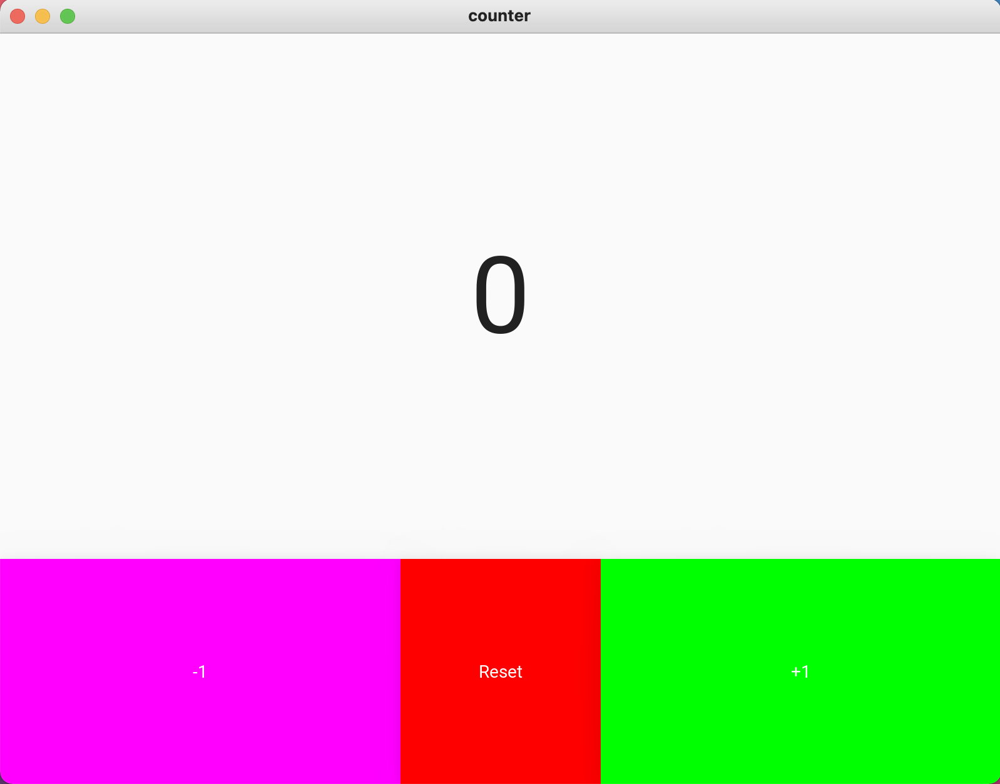

# Counter

### Python Code

```.py
from kivymd.app import MDApp
from kivymd.uix.screen import MDScreen

class calculator(MDApp):
    def build(self):
        return


calculator = calculator()
calculator.run()
```

### kivy Code

```.kv
Screen:
    size: 500, 500

    MDBoxLayout:
        orientation: "vertical"
        size_hint: 1, 1

        MDLabel:
            id: number_label
            text: "0"
            halign: "center"
            font_size: "64pt"
            size_hint: 1, 0.7

        MDBoxLayout:
            orientation: "horizontal"
            size_hint: 1, 0.3

            MDRaisedButton:
                id: subtract_button
                text: "-1"
                size_hint: 0.4, 1
                md_bg_color: 1, 0, 1, 1
                on_release:
                    app.subtract_button()

            MDRaisedButton:
                id: reset_button
                text: "Reset"
                size_hint: 0.2, 1
                md_bg_color: 1, 0, 0, 1
                on_release:
                    app.reset_button()

            MDRaisedButton:
                id: add_button
                text: "+1"
                size_hint: 0.4, 1
                md_bg_color: 0, 1, 0, 1
                on_release:
                    app.add_button()
```

### Test


