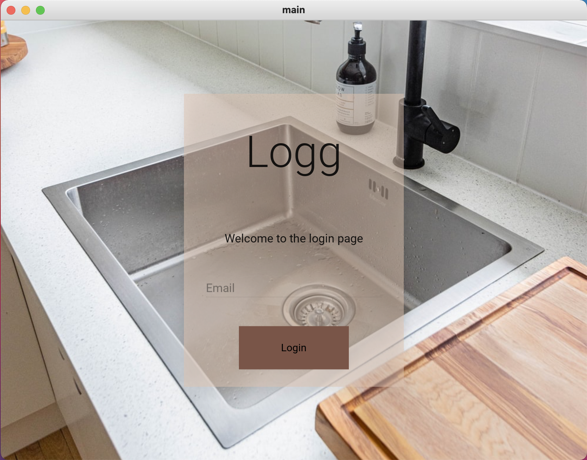

# Login page example

### Python Code

```.py
from kivymd.app import MDApp
from kivymd.uix.screen import MDScreen


class LoginScreen(MDScreen):
    ''' This class creates the log in window for the application'''

    def tryLogin(self):
        print("User tried to log in.")


class mainApp(MDApp):
    ''' This class creates the application'''

    def build(self):
        self.theme_cls.primary_palette = "Brown"
        self.theme_cls.primary_hue = "200"
        self._app_name = "logg"
        return


app_object = mainApp()
app_object.run()
```

### kivy Code

```.kv
# Define the screen manager. All apps need one
ScreenManager:
    id: scr_manager

    LoginScreen:
        name: "LoginScreen"

# Define the login screen
<LoginScreen>:
    BoxLayout:
        orientation: "vertical"
        size: 1000, 700

        FitImage:
            source: "kitchen_sink.jpg"

    MDCard:
        size_hint: None, None
        size: 600, 800
        elevation: 10
        pos_hint: {"center_x":.5,"center_y":.5}
        orientation: "vertical"
        # for colors, red green blue and transparency (RGB notation) from 0 to 1
        md_bg_color: 221/255, 195/255, 176/255, 0.3

        MDBoxLayout:
            id: content
            orientation: "vertical"

            MDLabel:
                text: "Logg"
                halign: "center"
                size_hint: 1, .2
                font_style: "H2"

            MDLabel:
                text: "Welcome to the login page"
                halign: "center"
                size_hint: 1, .1
                font_style: "Subtitle1"

            MDTextField:
                id: email_input
                hint_text: "Email"
                required: True
                helper_text: "Invalid email. Please try again."
                helper_text_mode: "on_error"
                size_hint: 0.8, 0.072
                pos_hint: {"center_x":.5}
                color_mode: 'custom' # allow customized text color
                line_color_focus: 0, 0, 0, 1

            MDLabel: # empty label to add space between other labels
                size_hint: 1, 0.03

            MDRaisedButton:
                text: "Login"
                size_hint: 0.5, .075
                pos_hint: {"center_x":.5}
                on_release:
                    root.tryLogin() # root is the same as self

            MDLabel:
                size_hint: 1, 0.03
```

### Test


