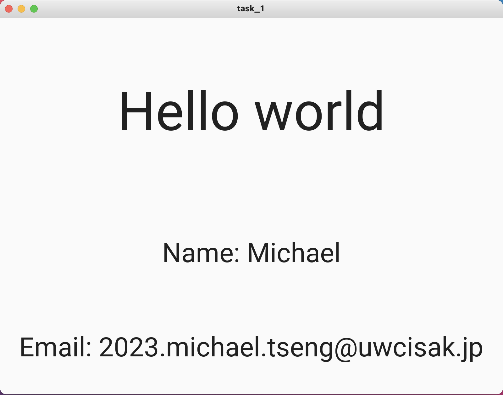

# Task 1

### Python Code

```.py
from kivymd.app import MDApp
from kivymd.uix.screen import MDScreen

class task_1(MDApp):
    def build(self):
        return

task_1 = task_1()
task_1.run()
```

### kivy Code

```.kv
Screen:
    MDBoxLayout:
        orientation: "vertical"
        size: 1000, 700

        MDLabel:
            text: "Hello world"
            halign: "center"
            font_size: "64pt"
            size_hint: 1, 0.1

        MDLabel:
            text: "Name: Michael"
            halign: "center"
            font_size: "32pt"
            size_hint: 1, 0.05

        MDLabel:
            text: "Email: 2023.michael.tseng@uwcisak.jp"
            halign: "center"
            font_size: "32pt"
            size_hint: 1, 0.05
```

### Test


