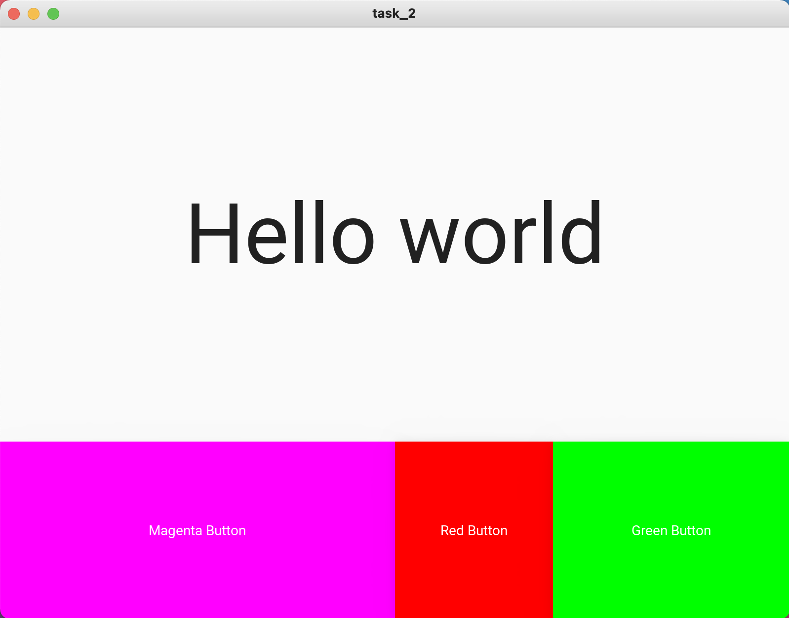

# Task 2

### Python Code

```.py
from kivymd.app import MDApp
from kivymd.uix.screen import MDScreen

class task_2(MDApp):
    def build(self):
        return

    def magenta_button(self):
        print("User clicked magenta button")
        name = self.root.ids.hello_world_label.text
        print(name)
        self.root.ids.hello_world_label.text = "Magenta Button pressed"
        self.root.ids.magenta_button.md_bg_color = 1, 0, 1, 1
        self.root.ids.red_button.md_bg_color = 1, 0, 0, 1
        self.root.ids.green_button.md_bg_color = 0, 1, 0, 1

    def red_button(self):
        print("User clicked red button")
        name = self.root.ids.hello_world_label.text
        print(name)
        self.root.ids.hello_world_label.text = "Red Button pressed"
        self.root.ids.magenta_button.md_bg_color = 1, 0, 0, 1
        self.root.ids.red_button.md_bg_color = 1, 0, 0, 1
        self.root.ids.green_button.md_bg_color = 1, 0, 0, 1

    def green_button(self):
        import random
        print("User clicked green button")
        name = self.root.ids.hello_world_label.text
        print(name)
        self.root.ids.hello_world_label.text = "Green Button pressed"
        self.root.ids.green_button.md_bg_color = random.randint(0, 1), random.randint(0, 1), random.randint(0, 1), 1


task_2 = task_2()
task_2.run()
```

### kivy Code

```.kv
Screen:
    size: 500, 500

    MDBoxLayout:
        orientation: "vertical"
        size_hint: 1, 1

        MDLabel:
            id: hello_world_label
            text: "Hello world"
            halign: "center"
            font_size: "64pt"
            size_hint: 1, 0.7

        MDBoxLayout:
            orientation: "horizontal"
            size_hint: 1, 0.3

            MDRaisedButton:
                id: magenta_button
                text: "Magenta Button"
                size_hint: 0.5, 1
                md_bg_color: 1, 0, 1, 1
                on_release:
                    app.magenta_button()

            MDRaisedButton:
                id: red_button
                text: "Red Button"
                size_hint: 0.2, 1
                md_bg_color: 1, 0, 0, 1
                on_release:
                    app.red_button()

            MDRaisedButton:
                id: green_button
                text: "Green Button"
                size_hint: 0.3, 1
                md_bg_color: 0, 1, 0, 1
                on_release:
                    app.green_button()
```

### Test


