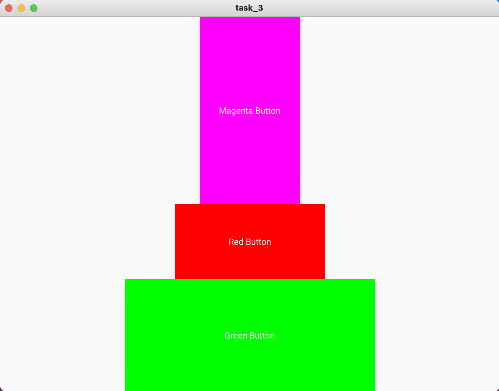

# Task 3

### Python Code

```.py
from kivymd.app import MDApp
from kivymd.uix.screen import MDScreen

class task_3(MDApp):
    def build(self):
        return

task_3 = task_3()
task_3.run()
```

### kivy Code

```.kv
Screen:
    size: 500, 500

    MDBoxLayout:
        orientation: "vertical"
        size_hint: 1, 1

        MDRaisedButton:
            halign: "center"
            pos_hint: {"center_x":.5}
            text: "Magenta Button"
            size_hint: 0.2, 0.5
            md_bg_color: 1, 0, 1, 1

        MDRaisedButton:
            text: "Red Button"
            pos_hint: {"center_x":.5}
            halign: "center"
            size_hint: 0.3, 0.2
            md_bg_color: 1, 0, 0, 1

        MDRaisedButton:
            halign: "center"
            pos_hint: {"center_x":.5}
            text: "Green Button"
            size_hint: 0.5, 0.3
            md_bg_color: 0, 1, 0, 1
```

### Test


